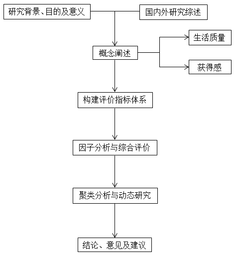
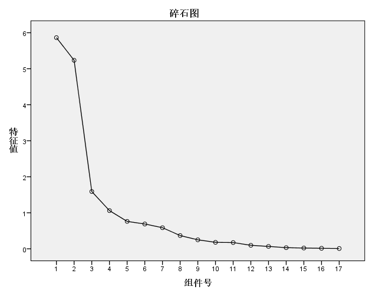

```{r setup, echo=F, purl=F}
knitr::opts_knit$set(root.dir = getwd())
knitr::opts_chunk$set(echo = TRUE, results = 'hide')
knitr::opts_chunk$set(warning = FALSE, message=FALSE)
knitr::opts_chunk$set(fig.align="center"
                      ## ,out.width="0.9\\textwidth" # latex
                      ,out.width="60%" # for both latex and html
                      ,fig.width=5, fig.height=3
                      )
```

```{r prepare, echo=F, purl=F}
rm(list=ls())
options(digits=4)
options(scipen=100)
graphics.off()
Sys.setlocale("LC_ALL", "Chinese")
```

<center>
摘要
</center>

随着社会的不断发展，人民对美好生活的向往越发强烈。而对美好生活的需要，不仅仅是解
决温饱问题，还包括要满足人们在政治、文化、环境、安全等方面日益增长的需要。2020年
我国即将实现全面建成小康社会的目标，全面小康的成果直接关系到国民生活质量的改善。
习近平总书记于2015年首次提出“获得感”的概念。而检验改革效果的最佳方式就是要看人民
群众对改革发展成果的切身感受。“让人民群众有获得感”正是检验任何改革含金量的重要标
尺。“获得感”一词体现了强烈的中国特色，它强调一种实实在在的“得到”，它不同于幸福
感，幸福难以衡量，容易流于空泛。另一方面，“获得感”的提出，使人民获得的利好能通过
评价指标得到更准确的反映和衡量。国内外早已有关于生活质量的研究，但在目前世界各国
的研究中选取的评价指标不一，对于生活质量的评价标准不一，同时各国的经济发展水平、
文化传统、历史背景等的不同也导致了研究的多样化。因此，对于国民生活质量的评价研究
应从本国国情出发，选取合适的评价指标，对当下我国人民生活水平有一个更为清晰和直观
的认识。本文利用国家统计局的最新数据，在参考和借鉴过往生活质量研究方法的基础上，
从“获得感”的角度出发，构建适宜的指标体系，利用SPSS软件进行综合分析，对当前我国居
民生活质量进行评价研究，并在本文最后针对现状提出一些具有参考意义的建议和意见。

【关键词】生活质量  获得感  指标体系  综合评价

<center>
Abstract
</center>

With the continuous development of society, people’s yearning for a better life
is becoming stronger. The need for a better life is not only to solve the
problem of food and clothing, but also to meet people’s growing needs in
politics, culture, environment and security. In 2020, China is about to achieve
the goal of building a moderately prosperous society in an all-round way. The
achievements of a moderately prosperous society in an all-round way are directly
related to the improvement of the quality of national life. General Secretary Xi
Jinping first put forward the concept of “sense of gain” in 2015. And the best
way to test if a reform has achieved its goal is to check people’s true feelings
about the reform fruits. So “making people have a sense of gain” is a decisive
rule to measure the gold content of any reform. The word “sense of gain”
embodies strong Chinese characteristics. It emphasizes a kind of real “gain”. It
is different from “Happiness”. Happiness is difficult to measure and easy to be
empty. On the other hand, the concept of “sense of gain” enables people’s gains
to be reflected and measured more accurately through evaluation indicators.
There have been many studies on the quality of life at home and abroad, however,
different evaluation indexes and evaluation standards for the quality of life
are used in different countries. At the same time, different countries’ economic
development level, cultural tradition, historical background and other
differences also lead to the diversification of research. Therefore, for the
evaluation of national quality of life, we should start from the national
conditions, select appropriate evaluation indicators, and have a more clear and
intuitive understanding of the current living standards of Chinese people. Based
on the latest data of the National Bureau of statistics and the past research
methods of quality of life, this paper constructs a suitable index system from
the perspective of "sense of gain", and makes a comprehensive analysis with SPSS
software to evaluate the current quality of life of Chinese residents. Some
suggestions and advices are also put forward at the end of the paper.

【Key words】Quality of Life; Sense of Gain; Index System; Comprehensive
Evaluation

# 绪论

## 研究背景

党在“十六大”上就明确提出要全面建设小康社会，而2020年也就是今年我们即将实现这一目
标。全面小康的建成意味着国家的改革成效惠及民生，我们每个公民都能感受到生活质量方
方面面的提升。进入建设社会主义的新时代，我国社会的主要矛盾已经转化为人民日益增长
的美好生活需要和不平衡不充分的发展之间的矛盾。生活质量的提升与改善，不仅仅体现在
物质层面，而是越来越多的反映在政治、文化、生态以及安全等多个层面上。因此，对当下
国民生活质量进行测评和评价，是建立在当前背景下十分突出的一个课题。习近平总书记于
2015年首次提出了“获得感”这样一个全新的概念，他指出要“让人民群众有获得感”，同时也
将此作为评价改革是否沿着改善民生的正确道路前进的重要标准。我们国家在贯彻实施各项
政策方针时，一贯强调“以人为本”，一切以人民的利益为出发点和落脚点。改革成果应由全
民共享，“获得感”所强调的正是一种实实在在的得到，检验改革的试金石就是人民群众的切
身感受。[@刘延年2006]“获得感”是极具中国特色的，也是符合民情、体贴民意的，它站在
一个更为客观、全面的角度来衡量人民的实际得到，相较于单纯地评估人们的主观感受，选
取多项客观指标来实际反映具体方面的改变更为直观。[@曹现强2017]正逢决胜全面小康的
关键之年，综合以上这些因素，笔者最终确立了“基于获得感的国民生活质量评价研究”为选
题，也对目前我国居民的实际生活水平有更为深入的认识。

## 研究目的

基于这样一个特别的时代背景，全面深化改革不断推进，全面建成小康社会的步伐逐渐加
快，这些年笔者自身也深刻的感受着国家的日新月异，经济社会的快速稳步增长，生活整体
一切向好的局势。改革开放以来，我国的综合国力不断增强，居民生活质量得以不断提升，
而这样的提升也正是社会发展的永恒主题，不论在哪个时代，改善民生都是政府实施改革举
措的最大动因。而除了民众的切身体会，运用具体的指标来对生活质量进行衡量无疑是非常
有必要的，数据所展示的变化给人的感觉是最直观的，纯粹的主观评价容易流于空泛。因
此，针对需要研究的课题，构建相应的指标体系，对当前国民生活质量的评价研究是至关重
要的。同时，我们也可以参考这样的评价结果，更多地发现现阶段仍然存在的问题，更有针
对性的提出建议及对策。[@彭念一2003]

总的来说，对国民生活质量的研究是十分有必要的，生活质量与我们每一个人都休戚相关，
而基于“获得感”的生活质量研究，更是对主观生活质量的有效补充，主客观结合起来的研究
成果更具有参考价值。鉴于这一领域的研究中尚无统一的评价指标，通过对评价指标的分
析，也为生活质量评价指标体系的构建提供了充足的依据。除此之外，通过最后的分析结
果，可以直观地看到国民生活中的哪些因素的对生活质量的影响更大，并有针对性的提出改
进建议，进一步考虑将研究结果融入城市建设规划中，必定能更加有助于城市完善自身，提
升整体形象，反过来就是对居民生活质量的更大改善。因此，这样的实证研究对于政府制定
相关条例以及开展各项工作也是大有裨益的。

## 国内外研究综述

对生活质量的研究，国外早于国内，由于各国发达程度、文化传统、福利水平等的不同，各
国对生活质量及其评价指标体系的研究各具特色，随着社会变迁、全球经济发展及人们生活
水平的不断提高，对生活质量的研究也不断深入和演进。“获得感”是极具中国特色的词汇，
国外尚无可供参考的研究内容，故笔者将从以下三个方面对生活质量的研究历程进行比较阐
述，为更具中国特色的从“获得感”角度出发的评价研究找到一条合适的路。

### 生活质量的研究现状

（1）国外生活质量研究现状

普遍学者认为，对于生活质量的研究，起源于西方发达国家，始于20世纪50年代。而生活质
量这一概念的提出，则可追溯到上世纪20年代，由英国福利经济学家庇古（1920）于《福利
经济学》一书中提出，用以描述福利的非经济方面。威廉•奥格博（1927）开始对生活质量
的研究产生兴趣，在之后的20多年时间里，他带领他的学生就“社会动向”领域进行研究，并
发表大量重要论著。在这期间，这类研究逐渐分化出两大主流：对生活质量的研究和对社会
指标的研究。美国密歇根大学的古瑞、威若夫和费尔德（1957）联合美国几大院校进行了一
次全国抽样调查，研究美国民众的精神健康及幸福感，标志着这一领域的研究走向成熟。而
学术界普遍认为，“生活质量”(Quality of Life)作为学术用语是由美国著名经济学家加尔
布雷斯（1958）在《富裕社会》一书中提出的。[@卢淑华1992]

此后，由于西方社会指标运动的兴起，对生活质量的研究也不断深入，从对“生活质量”概念
的理解到评价指标体系的逐步建立，理论研究也逐步过渡为实证研究。海德雷•坎崔尔
（1965）对包括美国在内的13个国家的生活满意度进行了比较研究，同年，诺曼•布拉德本
（1965）在一项全国民意调查中研究了美国民众的幸福感。鲍尔（1966）主编的《社会指
标》论文集更加激起了人们对生活质量这一研究领域的广泛兴趣。坎贝尔、康维斯和罗杰
（1976）在全美范围内进行了一次抽样调查，联合芝加哥大学全国民意调查中心和密歇根大
学社会研究所进行“可感生活质量”的模式分析，主要研究美国社会对生活整体的满意度和13
个生活具体方面的满意度。20世纪80年代，对生活质量的研究在维度和深度上又得到了进一
步拓展，研究角度也开始沿着主观指标和客观指标两个方面分别进行。进入20世纪，伴随着
物质生活条件和社会福利更快进步和改善，对生活质量的评价指标体系内容也越发广泛，所
涉及的领域也不局限于经济发展带来的社会效益，人们的精神满足感、政治参与度以及人居
环境得到了更多关注。[@游芳2016]史莱斯特（2018）通过制定客观的水安全指数，研究其
与发展中国家城市地区生活质量的关系。同时，在医学领域上对特定群体生活质量的研究也
得到发展，例如巴拉尼（2019）就跟踪研究了辅助心理治疗对恶性血液病患者生活质量的影
响。各国各研究组织也都建立了自己的评价指标体系，从不同角度出发，对本国或世界各国
的人民生活质量进行评估和衡量。

（2）国内生活质量研究现状

相较于国外，我国对生活质量的研究起步较晚，始于20世纪80年代。改革开放给中国人民生
活的方方面面带来了前所未有的影响，生活水平逐步提高使得生活质量得到越来越多的重
视，与此同时，受国外生活质量理论研究和生活质量评价指标体系研究的影响，国内学者也
在思考着如何对国民生活水平进行衡量。纵观国内学者的研究情况，大多数学者主要从经济
学和社会学角度出发，对我国人民生活质量进行评价研究。

美国社会学家林南教授（1985）与天津社科院社会学所对天津的近一千户家庭进行了生活质
量调查。他们将生活质量分为结构、导因及结果三个主题，挑选出22个单项指标，对这些生
活单项内容的满意程度进行综合分析，并用结构方程法逐层合并分析，建构起并最终验证了
分层式结构理论模式。[@林南1987]林南与卢汉龙等人（1987）对上海1200名18岁以上的成
年居民实施调查，并将调查汇总的资料分为两部分，一部分为构成个体生活的各类社会环境
条件，即反映群众生活客观状况的社会指标；另一部分为个体对生活的各类评价，即对生活
质量的主观评价指标，通过多元回归建立了社会指标与生活质量结构模型。[@林南1989]卢
淑华和韦鲁英（1992）根据北京、西安和扬州三市的抽样调查资料，从方法论的角度，对生
活质量研究中的主、客观指标的作用及相互关系进行探讨，形成了三级主、客观作用机制模
型，从而大大增加对生活质量满意度的解释力。[@卢淑华1992]范柏乃（2006）根据个人对
生活质量概念的理解，结合城市居民生活的特征，遴选出64个评价指标构成中国城市居民生
活质量理论评价体系，再运用相关分析、隶属度分析、鉴别力分析等方法进行实证筛选，最
终构建了由30个指标组成的城市居民生活质量评价体系，并运用该体系对我国31个地区的居
民生活质量进行测度评价。陈燕明（2011）对全国287个城市的相关数据建立评价模型，研
究我国城市居民生活质量的影响因素。孙计领等（2019）从主客观两大维度构建了一套生活
质量测评指标体系，测度了中老年健全人和残疾人的生活质量水平，旨在更多的关注中老年
残疾人的生活。

随着生活质量研究的不断发展，有越来越多的专家、学者从不同角度出发，挑选与自己的研
究内容相契合的评价指标，通过因子分析等方法，建立评价指标体系，并对调查地区的数据
进行实证研究，提出了自己的观点结论，国内有关这一领域的研究文献数量也在一直呈现可
观的增长，此处不再一一赘述。

（3）基于“获得感”的生活质量研究现状

“获得感”是一个极具中国特色的本土词汇，在国外尚无对应的概念。“获得感”一次的提出正
值我国全面深化改革的关键时期，是对“客观获得”的主观感觉。相较于此前在生活质量研究
领域的热门词“幸福感”和“主观生活质量”，“获得感”更加强调人民的客观获得，以实实在在
的物质和经济利益为基础，涉及对政治、文化、社会、环境、健康和教育等诸多方面发展成
果的获得。

在这一方面，一些国内学者从不同研究侧重点出发，选取不同指标对获得感进行衡量。孙远
太（2015）在城市居民社会地位对其获得感的影响分析中，以居民生活的改善情况来衡量获
得感。文宏、刘志鹏（2018）利用CGSS调研数据对我国人民获得感进行了时序比较分析。谭
旭运、张若玉、董洪杰等人（2018）采用中国社科院和智媒云图联合发布的民众获得感状况
的抽样调查数据，从获得感的项目重要性、当前获得感知及未来获得预期三个方面，分析了
18~35岁青年的获得感现况及相关因素。阳义南（2018）从充足性、便利性、普惠性、均等
性四个方面测量8项民生公共服务带给民众的获得感。但这些研究或多或少都存在着指标体
系的构建过于简单，概念缺乏一定的科学性，让普通群众在理解上略有困难等问题。但从整
体来看，现阶段针对“获得感”的研究大多为概念阐述和理论研究，实证研究相对较少，如何
构建一个合理的“获得感”指标测评体系，是一个亟待解决的议题。[@王积超2019]

### 生活质量的测评方法

1. 研究对象的特点

根据目标群体的不同，对生活质量的研究可分为两类。一类为以国家或地区（区域）划分的
普通大众人群为研究对象，例如上文中提到的国内外众多专家及学者都对本国或某个地区的
居民生活质量进行调查研究，此类研究主要集中在发达国家对城市居民的生活质量研究上，
以及对不同地区之间的比较研究上。另一类主要集中在对某一类特殊人群生活质量的研究，
例如在医学研究领域中对某种特定疾病的患者在接受治疗后的康复阶段及之后的生活质量的
跟踪研究，对此类特殊人群来说，一般意义上的“生活质量”则更适合称之为“生存质量”。费
耶尔等人（2009）就针对患者由于疾病引起的疼痛、腹泻和呕吐等症状与个人心情与心理状
态间的因果关系进行了研究和分析，用以评估患者的生存质量。

2. 指标的来源角度

（1）基于主观指标研究

从主观角度出发的生活质量研究，是用反映人们对生活各方面的满意度和幸福感的主观感受
的指标进行测评。例如上文提到的坎贝尔等人就建立了一种感觉指标模型(Cs—Cd等级模
型)，用于研究美国社会的生活质量。该模型将人们对生活质量的主观感受分成完全不满意
到完全满意的几个等级，其中研究者着重研究美国社会对生活整体的满意度和13个生活具体
方面的满意度。在这一角度上，主观幸福感常被用于代表生活质量，同时，此方法也会引入
一些个人经验指标对一般社会、经济领域指标进行补充。

（2）基于客观指标研究

客观指标涉及经济、政治、文化、社会、生态等各个方面的衡量指标，客观指标的选取也会
随着时代变迁及社会发展不断扩充和丰富。客观指标用衣食住行等与人们日常生活息息相关
的指标来反映人们生活水平及实际享有程度，与主观指标反映人们主观感受不同，运用客观
指标的研究方法更注重实际获得感。例如，刘本杰（1976）根据美国1970年人口普查资料构
建了一套由客观因素构成的生活质量指标体系，包括经济、政治、教育、环境和健康5个主
要大类，其中每一大类又包含了许多不同的个体指标。[@邬华强2015]

在我国也有一些选用客观指标进行研究的实例。中国社科院朱庆芳研究员（1988）主持的
“社会发展与社会指标”课题组就通过一系列反映人们生活水平的客观条件的指标对我国居民
生活质量和社会发展进行评估，起初共选择了12个指标(包括居民消费、收入、物价指数、
生活便利程度、精神生活等)作为反映生活质量的指标体系。随后又在1989年、1992年分别
对指标体系进行了扩充，增加了社会福利、环境保护等方面的指标。这也表明，随着经济社
会综合水平的不断提升，衡量生活质量的指标趋于多元化，除物质方面的指标越来越多地被
纳入评价体系中。[@上海财经大学课题组2019]

（3）主客观指标结合研究

在指标体系的构建中，同时选取主、客观指标也是研究者们会采取的一种方法，指标的选取
也更为广泛和多元化。从当前研究现状来看，将主客观指标结合研究的趋势愈发明显，在关
注人们主观感觉的同时，也通过衡量客观指标来评估整体水平的变化，更有针对性地考查特
定地区、特定群体、特定领域的指标水平。

3. 指标的数量

根据指标数量的不同，有使用单一复合指标和构建指标体系两种方法。在早期的生活质量研
究中，研究机构和专家学者们更多地是用一个综合指数来评估不同地区的生活质量，如世界
银行提出的生活质量指标，海外发展委员会(ODC)提出的物质生活质量指数(PQLI)，理查德•
埃斯蒂斯（1984）提出的社会进步指数(ISP)等。而更多研究者则会构建自己的一套指标体
系，并进行筛选，形成覆盖各领域的大类包涵小类的指标系统，通过打分或赋予权重的方式
得到侧重点不同的生活质量测评指标。上文提到的众多学者采用的都是此种方法。[@刘延年2006]

### 总结

总体上看，回顾国内外过往的生活质量研究历程，可以得出以下几点结论：首先，国外生活
质量研究早于国内，几十年来国内外研究成果均有丰富的成果，且随着社会进步不断发展完
善；其次，目前国际上并没有统一的对“生活质量”的定义，也没有统一的评价标准，各国各
机构均由自己创建的测评指标；再次，对生活质量的研究呈现出由客观指标评价转向侧重对
人的主观幸福感和生活满意度的研究，而主观生活质量和客观生活质量结合的研究尚无较大
进展，尤其是缺少对主客观指标相互关系及作用机制的探讨；最后，由于制定的标准不同，
即使是针对同一地区相同群体的生活质量研究，不同研究成果之间的可比性并不高，特别是
鲜有研究人员在前人研究成果的基础上分析完善进行的研究，使得整个领域的研究难以层层
深入。

另外，有一些重要问题应当明确。一是，由于对“生活质量”的定义不一，这其中也无法评判
孰是孰非，故研究者应明确自己的理解，找到研究的方向和侧重点是什么。二是，“生活满
意度”和“幸福感”是存在差别的，前者源于社会学角度，属于人们认知层面的评价，后者源
于心理学角度，更多的是情感层面的体验。同时二者都受到个人认知水平、价值观等的影
响，故在实际研究中，不能单一地选取主观指标，应主客观结合研究。三是，对于不同经济
发展水平的人群来说，主客观指标的影响程度不同，并不具有直接的正比关系，主观指标适
宜进行同一地区的纵向研究，而不适合不同地区的横向研究，避免轻易得出诸如“高生活水
平群体对生活整体现状不够满意”的结论。四是，充分借鉴前人的研究方法，参考指标的选
取、指标的权重赋予等，使结论更具可比性。五是，鉴于基于“获得感”的生活质量评价研究
没有充足的研究结果可供参考，需先理清定义，再选择研究方法。

## 研究方法与研究思路

### 研究方法

（1）文献研究法

笔者从中国知网、万方数据、维普中文期刊数据库、国家哲学社会科学学术期刊数据库、
Elsevier Science Direct数据库、SSCI社会科学引文索引等数据库收集了多篇与生活质量
评价研究相关的论文，并在阅读这些论文的基础上，将对本文研究具有参考价值的信息进行
筛选和整合，形成了文献综述，为本文的研究奠定了良好的理论基础。

（2）因子分析

因子分析是通过对变量之间关系的研究，找出能综合原始变量的少数几个因子，使得这少数
几个因子能够反映原始变量的绝大部分信息。因子分析的核心思想是“降维”，其目的就是要
减少变量的个数，用少数几个不相关的因子代表多个原始变量。因子分析大体上需要经过数
据检验、因子提取、因子命名和解释、计算因子得分并进行综合评价等几个步骤。

（3）聚类分析

聚类分析是按照“相似性”把对象进行分类的一种多元统计方法，“聚类”就是将对象按照反映
其特征的数据分成不同的类别，从而使得类别内部的差异尽可能小，类别之间的差异尽可能
大。常用的聚类方法有两种，一种是系统聚类（层次聚类），这种方法事先不确定要分多少
类，且适用于数据量较少的情形；另一种是K-均值聚类（快速聚类），应用此方法是根据事
先确定的K个类别反复迭代直到把每个样本分到指定的类别中，且类别数目的确定具有一定
的主观性。但无论是哪种聚类方法，最终要分成多少类别，并不完全是由方法来决定，还应
结合具体问题分析而定。

### 数据来源与研究思路

（1）数据来源

本文所用到的数据均来源于国家统计局官方网站和统计年鉴，数据保证真实、准确。由于
2019年的年度数据尚未发布，因此选择了2018年的年度数据进行分析，尽量保证数据的时效
性，对研究结果的分析也就更具现实意义和参考价值。

（2）研究思路



## 本文的创新与不足

1. 创新点

（1）本文更侧重于通过选取衡量国民的各方面实际“获得”的指标来对地区生活质量进行评
价。

（2）本文选取的统计局官网数据更加真实准确，有时效性。

2. 不足与展望

（1）在指标体系的构建中，笔者参考了其他一些研究的指标体系，尽量让本研究的指标体
系覆盖更为全面，指标体系更具参考价值。但由于反映人民获得感的生活质量评价指标众
多，同时需兼顾统计软件运行结果的质量，不可能全部纳入指标体系，因此难免有无法反映
的方面。

（2）由于在实证研究中发现一些方法的可操作性不强，故限制了笔者更多角度的研究，比
如收集专家打分，研究生活质量的影响因素等。本研究所用到的方法与数据与其他研究各有
不同，因此研究结果的准确性有待进一步考证。

（3）鉴于笔者学识有限，在研究最后提出的建议部分是否具有科学性和可实施性，这个问
题同样值得商榷。

# 概念界定

在开展相应的研究之前，首先要对研究涉及的相关概念进行界定和梳理。本文将综合之前学
者的理论成果，对“生活质量”以及“获得感”的概念进一步阐释说明。

## 生活质量

由于生活质量所涉及的领域众多，可供研究的内容也十分广泛，所以到目前为止，国际上暂
没有明确的统一定义，各国的专家学者也都有自己对“生活质量”的定义。随着时代的变迁和
研究的不断深入，生活质量的定义也在逐步拓展。对于不同的对生活质量的理解，与生活质
量的指标研究的类别相适应，对它的定义也可以大致划分为三种，即主观角度、客观角度和
主客观结合的角度来定义。

### 从主观角度来理解

从主观角度对生活质量定义的，主要是西方发达国家的一些研究学者。加尔布雷斯（1958）
认为，“生活质量是指人的生活舒适、便利的程度，精神上所得到的享受和乐趣”，生活质量
的本质是一种主观体验，生活质量的主要内容是个人对其人生际遇的满意程度以及在社会中
实现自我价值的体验等。坎贝尔等人（1976）将生活质量定义为人们对生活幸福的总体感
觉。林南（1985）则将其定义为“人们对生活及其各个方面的评价和总结”。可以看出，主观
角度的定义注重人本身对生活的整体体验，个人对生活总体满意度的评估。主观生活质量的
衡量因此也容易受到评价个体的认知水平和情感偏向的影响。

### 从客观角度来理解

客观生活质量是生活条件的综合反映，生活条件的改善也就意味着生活质量的提高。我国较
多学者正是从客观角度出发，来对“生活质量”进行定义。厉以宁（1986）认为“生活质量”是
反映人们生活和福利的一种标志，它主要包括自然方面和社会方面两方面的内容。生活质量
的自然方面是指人们生活环境的美化、净化等等；而生活质量的社会方面是指社会文化、教
育、交通、卫生、生活服务状况和社会秩序等等。也有一些西方学者持类似观点，例如美国
经济学家罗斯托（1971）就认为生活质量的概念与经济增长阶段相联系，从某种意义上讲，
可以说是经济增长过程中的必然产物。[@彭念一2003]

### 从主客观结合的角度来理解

陈义平（1999）提出，生活质量是“社会提供国民生活的充分程度和国民生活需求的满足程
度”，从社会生活供给和国民生活需求两方面进行定义，是目前受到普遍认可的对生活质量
较为全面的一个定义。此定义既衡量了客观条件的水平，也将个人的实际感受考虑其中。现
阶段已有越来越多的国内外学者站在这个角度来定义“生活质量”，也逐渐认识到主客观因素
无法相互替代，二者在国民生活质量的研究中都是不可或缺的。[@风笑天2007]

综上，本文从主客观结合的角度，将“生活质量”定义为：建立在一定物质条件基础上，与社
会发展水平相适应的，社会成员对满足个人生存及发展的各方面情况的总体认同感。

## 获得感

自2015年习近平总书记在中央全面深化改革领导小组第十次会议上首次提出“获得感”以来，
“获得感”便成为了中央文件中频繁提及的重要概念，也成为媒体和大众讨论的“热词”。鉴于
“获得感”一词强烈的中国特色，要准确理解其内涵，我们必须把它放到中国特色社会主义新
时代下全面深化改革、加快转变经济社会发展模式、打赢脱贫攻坚战决胜全面小康的时代背
景中来理解。“改革要让人民群众有更多获得感”，人民群众的获得感是改革发展的动力源
泉，也是改革的目标和落脚点，更是改革的评价标准和价值归宿。

针对这一概念，有不少专家学者都发表了自己的理解和看法。丁元竹（2016）认为“获得感”
是对“获得”的主观感受，是建立在“客观获得”基础之上对“客观获得”的主观感觉。王恬等人
（2018）提出，获得感是指个体获取物质和精神利益后所产生的满足感。吕小康、黄妍
（2018）则认为获得感是实实在在的物质利益和基本权益的普惠性的主观体验。一方面，
“获得感”要以获得实实在在的物质利益和经济利益为基础，同时又不局限于物质方面的获
得，还包括享有政治权利，共享社会、文化、生态方面的建设成果，还体现为每个个体获得
提升自我、实现自我价值的机会。另一方面，获得感也囊括了个体的主观感受和评价。除此
之外，有一点必须强调的是，“获得感”不是个人的，而是所有人的，它强调公平公正，必须
保证每个人在全面小康的进程中都不掉队。[@邵雅利2019]

“获得感”是一个内涵丰富的词汇，相较于“幸福感”，它衡量的是实际得到，有助于我们在生
活质量的研究中透过指标评价得出结论。概括来说，“获得感”是全体人民对在政治、经济、
文化教育、社会生活以及生态环境等生活的各个方面上所获得的物质和精神利益的主观满足
程度。

# 基于获得感的国民生活质量评价指标体系的构建

## 指标体系的构建原则

由于单一指标远远无法满足生活质量评价研究的需要，故需要通过构建科学、合理、有效的
指标体系来对现有数据进行更为准确的衡量和评估，通过选取单个指标来构建一个完整的指
标体系需要满足以下几个原则：

（1）科学性原则。指标需要针对研究的具体问题来选取，适合的指标才能满足我们对研究
分析的需要，因此指标体系的构建必须具有一定的目的性，同时能为我们的研究进行更深
入、更系统的层层分析提供强有力的依据。指标体系的内容应与研究对象相适应，并且在选
取的过程中尽量排除主观情感的影响。多数时候评价指标体系的构建不具唯一性，因此可以
采取经验预选、专家咨询等方法，充分参考其他类似研究中指标体系的构建方法，并最终形
成符合自身研究内容的指标体系。

（2）全面性原则。由于生活质量涉及居民生活的众多领域，包括经济、政治、文化、社
会、生态等诸多方面，因此指标体系必须涵盖不同领域的指标，以充分、全面、客观地反映
多种不同影响因素对国民生活质量的综合作用。除此之外，选入指标体系的指标应当是典型
的、具有代表意义的，否则难以对研究结果进行解释说明。

（3）可比性原则。研究中构建的评价指标体系应是具有比较意义的。为此，需要明确各项
指标的含义、研究意义、计算口径等，以便最终结果可以在不同情况下展开多方面的比较。

（4）可操作性原则。选中的指标不仅要能满足定量分析数据处理的需要，也要能够较容易
地找到准确的、具有利用价值的数据，如此便于后续研究工作的开展。

## 指标体系的内容

鉴于本文对国民生活质量的评价研究是从“获得感”角度出发的，故在指标的选取上与以往一
般的生活质量研究的侧重点会有不同，本文所遴选的指标更加倾向于客观“得到”的衡量。综
合之前理论研究的结论，在充分吸收借鉴前人研究成果的基础上，笔者将从以下几个层次逐
步构建起完整的基于“获得感”的国民生活质量评价指标体系。

### 经济获得感指标

收入的获得给予人们更加切身、实在的获得感体会，同时人们在精神等其他方面的追求也是
建立在较为满足的物质需求之上，因而经济指标对于衡量国民生活质量而言，毫无疑问是必
不可少的。

（1）人均地区生产总值（元/人）：人均国内生产总值是指国内生产总值的绝对值与该年平
均人口的比值，是衡量一个国家或地区每个居民对该国家或地区的经济贡献或创造价值的指
标，对于评估当地居民的平均经济水平具有重要意义。

（2）居民人均可支配收入（元）：居民可用于最终消费支出和储蓄的总和，即居民可用于
自由支配的收入。既包括现金收入，也包括实物收入。居民可支配收入被认为是消费开支的
最重要的决定性因素，可以用来衡量一个国家生活水平的变化情况。

（3）城镇单位就业人员平均工资（元）：平均工资指单位就业人员在一定时期内平均每人
所得的货币工资额。它表明一定时期职工工资收入的高低程度，是反映就业人员工资水平的
主要指标。

### 政治获得感指标

国民的政治获得感主要来源于民众政治参与度和对国家的廉政评价上，由于本研究调查范围
广泛，难以收集到全面的指标数据，故以社会团体单位数和自治组织单位数作为百姓政治参
与度的代表指标。

（1）社会团体单位数（个）：社会团体，是指为一定目的由一定人员组成的社会组织，可
分为以营利为目的和以非营利为目的两类社会团体。前者如合作社、公司等；后者如政治、
宗教、科技、文化、艺术、慈善事业等社会群众团体。社会团体是当代中国政治生活的重要
组成部分。

（2）自治组织单位数（个）：基层群众性自治组织，是中国在城市和农村按居民的居住地
区建立起来的居民委员会或者村民委员会，是城市居民或农村村民自我管理、自我教育、自
我服务的组织。自治组织单位数一定程度上反映了政治参与和自我管理的水平。

### 文化获得感指标

在抓好经济建设的基础上，精神文明的建设也越来越受到广泛的重视。大众在解决温饱等基
本生活问题之后，就会逐步满足生活其他方面的多样需求，精神方面的需求便是其一。与此
同时，教育水平的进步也可以进一步提升人们的整体文化素质。所以文化获得感可以从精神
文明和教育两方面的指标进行诠释。

（1）人均拥有公共图书馆藏量（册/人）：书籍对人类来说是实现自我提升、充实业余生活
的绝佳选择，一个城市的公共图书馆数及图书馆馆藏数量也是一个很好的衡量精神文明建设
水平的有力指标，人均拥有馆藏量反映出城市图书资源的丰富程度和民众资源享有量。

（2）博物馆机构数（个）：博物馆体现了地域特色和文化底蕴，博物馆的建设为民众拓展
视野、学习历史知识提供了很多机会，能够反映大众在精神文明方面的满足程度。

（3）每十万人口平均在校生数（人）：该指标涵盖幼儿园、小学、初中（包括普通初中和
职业初中）、高中（包括普通高中、成人高中、普通中专、职业高中、技工学校和成人中
专）及高等学校（包括普通高等学校和成人高等学校）的在校学生人数，某种程度上反映了
一个国家或地区平均受教育水平，是文化强国的重要内容。

### 社会获得感指标

社会获得感层面包含的内容尤为广泛，涉及医疗、住房、养老、交通、公共安全、社会保障
和城市建设等多个方面，本文选择了部分较有代表性的指标纳入指标体系之中。同时，这些
指标还或多或少能反映出除社会建设水平的其他方面的问题，因此具有非常好的评估意义和
参考价值。

（1）医疗卫生机构数（个）：医疗卫生机构包括医院、基层医疗卫生机构、专业公共卫生
机构以及其他医疗卫生机构。医疗机构的建设是城市基础设施的反映，其建设越完善，民众
在看病求医方面的需求越能得到满足。

（2）每万人拥有公共交通车辆（标台）：按城市人口计算的每万人平均拥有的公共交通车
辆标台数。交通出行方式多变且牵涉人员众多，公共交通的便利程度与居民生活质量必然具
有较强的关联性。

（3）互联网宽带接入用户（万户）：当今互联网对于居民日常生活可以说是不可或缺的存
在，而互联网宽带接入用户的增长表明互联网的普及率的上升，互联网为人们的生活带来极
大的便利，也影响着人们的生活质量。

（4）移动电话普及率（部/百人）：电话的使用关乎每个人的日常生活，移动电话的普及与
社会基础设施建设和通讯效率都密切相关。

（5）每万人拥有卫生技术人员数（人）：卫生技术人员包括执业医师、执业助理医师、注
册护士、药师（士）、检验技师（士）、影像技师、卫生监督员和见习医（药、护、技）师
（士）等卫生专业人员，且不包括从事管理工作的卫生技术人员（如院长、副院长、党委书
记等）。拥有专业的卫生技术人员也是社会高发展质量的体现。

（6）生活垃圾无害化处理能力（吨/日）：生活垃圾无害化处理厂（场）按工艺设计每天所
能处理生活垃圾的数量。一方面是城市基础建设的能力的反映，另一方面也是评估市容卫生
环境的参考指标。

（7）城市污水日处理能力（万立方米）：污水处理厂和污水处理装置每昼夜处理污水量的
设计能力。污水处理设备的处理能力是城市市政设施建设水平的其中一个反映指标，除了提
供给居民日常生活用水，生活污水得到有效处理也是城市市政能力建设的反映。

### 生态获得感指标

居住环境的质量对人们的生活质量和生活体验有非常大的影响，环境生态的优化改善不仅使
得市容市貌得到改观，也让身处其中的居民有更加宜人的生活环境。

（1）建成区绿化覆盖率（%）：报告期末建成区内绿化覆盖面积与区域面积的比率。城市绿
化对于市容市貌是十分重要的。

（2）人均公园绿地面积（平方米/人）：报告期末城区内平均每人拥有的公园绿地面积。在
对生态环境获得感的评价中，人居环境的指标尤为重要。

<center>
表3.1 基于获得感的国民生活质量评价指标体系
</center>

||||
|:----:|:----:|:----:|
|经济获得感指标|人均地区生产总值|元/人|
||居民人均可支配收入|元|
||城镇单位就业人员平均工资|元|
|政治获得感指标|社会团体单位数|个|
||自治组织单位数|个|
|文化获得感指标|人均拥有公共图书馆藏量|册/人|
||博物馆机构数|个|
||每十万人口平均在校生数|人|
|社会获得感指标|医疗卫生机构数|个|
||每万人拥有公共交通车辆|标台|
||互联网宽带接入用户|万户|
||移动电话普及率|部/百人|
||每万人拥有卫生技术人员数|人|
||生活垃圾无害化处理能力|吨/日|
||城市污水日处理能力|万立方米|
|生态获得感指标|建成区绿化覆盖率|%|
||人均公园绿地面积|平方米/人|

# 基于获得感的国民生活质量综合评价

## 国民生活质量地区差异研究

### 原始数据的标准化处理

在评价指标体系中，由于各指标具有不同的单位和变异程度，指标之间无法直接运算和比
较，故为了消除量纲和变量自身数值以及变异大小的影响，在正式分析之前，需要对指标数
值采取标准化处理。对数据进行标准化处理的方法有多种，本文运用SPSS软件对原始数据进
行处理，采用的方法为“Z-score标准化”法。Z-score标准化也称标准差标准化，经过标准化
处理后的数据的均值为0，标准差为1，其转化公式为：

$${x}'=\frac{{x-\bar{x}}}{\sigma}$$

式中 $x$——原始数据

$\bar{x}$——原始数据的均值

$\sigma$——原始数据的标准差

${x}'$—标准化的数据

### 因子分析的适用性检测

在进行因子分析之前，需要对进入指标体系的变量之间的相关性进行检测，只有当变量间存
在一定的线性关系，具有某些共享信息，才适合做因子分析。利用SPSS软件得到KMO和巴特
利特球形度检验的结果如下表所示。

<center>
表4.1 KMO和巴特利特检验
</center>

||||
|:----:|:----:|:----:|
|KMO 取样适切性量数||.668|
|巴特利特球形度检验|近似卡方|574.666|
||自由度|136|
||显著性|.000|

可以看到，KMO值为0.668>0.6，且巴特利特球度检验的显著性p值近乎为0，即变量间存在较
强的相关性，故适合做因子分析。

### 公因子的提取与方差贡献率

参与评价的指标共有17个，而我们进行因子分析就是为了利用更少数的几个公共因子尽可能
的反映原始变量的大部分信息，从而达到变量降维的目的。公因子的提取方法有多种，本文
采用的是主成分法，它假设原始变量是公因子的线性组合。公因子数量的确定可以根据因子
方差的贡献率来选择，而从特征根的角度来看，一般要求因子对应的特征根大于1，因为特
征根小于1的因子还不如原始变量的解释力度大。

<center>
表4.2 总方差解释
</center>

|成分||初始特征值|||提取载荷平方和|||旋转载荷平方和||
|:----:|:----:|:----:|:----:|:----:|:----:|:----:|:----:|:----:|:----:|
||总计|方差百分比|累积%	|总计|方差百分比|累积%|总计|方差百分比|累积%|
|1|5.865|34.498|34.498|5.865|34.498|34.498|5.376|31.625|31.625|
|2|5.235|30.792|65.290|5.235|30.792|65.290|4.985|29.322|60.947|
|3|1.591|9.360|74.649|1.591|9.360|74.649|1.951|11.477|72.424|
|4|1.062|6.245|80.895|1.062|6.245|80.895|1.440|8.471|80.895|
|5|.762|4.482|85.377|||||||
|6|.689|4.053|89.430|||||||
|7|.586|3.447|92.878|||||||
|8|.368|2.166|95.043|||||||
|9|.250|1.468|96.512|||||||
|10|.180|1.058|97.570|||||||
|11|.174|1.023|98.593|||||||
|12|.098|.576|99.168|||||||
|13|.066|.389|99.557|||||||
|14|.031|.183|99.740|||||||
|15|.021|.124|99.864|||||||
|16|.015|.086|99.951|||||||
|17|.008|.049|100.000|||||||

提取方法：主成分分析法。



从累积方差贡献率来看，提取4个因子能保留原始变量80.895%的信息，且他们的特征根均大
于1。因子旋转后的累积方差没有改变，只是各因子所解释的原始变量的方差发生了变化。
再结合碎石图来看，从第5个因子开始特征值变得平缓，故本文提取4个公共因子的效果较
好。

### 因子的命名与解释

因子命名是因子分析中十分重要的一步，公因子包含的是多个原始变量的信息，需要通过对
因子的重新命名来反映原始变量的共同信息，以便对研究结果做出合理的解释。因子命名需
要考察因子载荷矩阵，并结合实际情况来进行。当因子载荷a_ij的绝对值在第i行的多个列
上都有较大的取值（通常大于0.5）时，表明原始变量与多个因子都有较大的相关关系，即
原始变量x_i需由多个因子共同解释。如果因子载荷a_ij的绝对值在第j列的多个行上都有较
大的取值，则表明因子f_i无法有效代表任一个原始变量x_i，对因子f_i的解释也就比较困
难。此时，需要进一步作因子旋转，使得因子的含义更加清楚，以利于因子的命名和解释。
这里采用的是最常用的Varimax法（方差最大正交旋转），该方法的原理是使各因子保持正
交状态，但又尽量使各因子方差达到最大，即相对的载荷平方最大，以便对因子的解释。

<center>
表4.3 成分矩阵a
</center>

||成分||||
|:----:|:----:|:----:|:----:|:----:|
||1|2|3|4|
|人均地区生产总值|.690|-.631|-.100|-.001|
|居民人均可支配收入|.675|-.691|-.111|.028|
|城镇单位就业人员平均工资|.307|-.807|-.066|-.037|
|社会团体单位数|.671|.487|-.120|-.239|
|自治组织单位数|.445|.708|-.139|.380|
|人均拥有公共图书馆藏量|.382|-.755|-.361|-.090|
|博物馆机构数|.602|.545|-.212|.289|
|每十万人口平均在校生数|-.199|.510|.419|-.282|
|医疗卫生机构数|.396|.769|-.109|.276|
|每万人拥有公共交通车辆|.544|.054|.405|.459|
|互联网宽带接入用户|.783|.569|-.157|-.116|
|移动电话普及率|.617|-.646|.266|.008|
|每万人拥有卫生技术人员数|.507|-.598|.350|.375|
|生活垃圾无害化处理能力|.874|.218|-.121|-.293|
|城市污水日处理能力|.859|.208|-.199|-.295|
|建成区绿化覆盖率|.560|.079|.536|-.160|
|人均公园绿地面积|.353|.226|.667|-.215|

提取方法：主成分分析法。

a. 提取了 4 个成分。

<center>
表4.4 旋转后的成分矩阵a
</center>

||成分||||
|:----:|:----:|:----:|:----:|:----:|
||1|2|3|4|
|人均地区生产总值|.915|.198|.080|.043|
|居民人均可支配收入|.958|.154|.051|.055|
|城镇单位就业人员平均工资|.841|-.187|-.008|-.093|
|社会团体单位数|-.017|.840|.227|-.033|
|自治组织单位数|-.310|.710|-.071|.508|
|人均拥有公共图书馆藏量|.875|.014|-.220|-.203|
|博物馆机构数|-.081|.776|-.064|.417|
|每十万人口平均在校生数|-.586|.020|.445|-.113|
|医疗卫生机构数|-.393|.712|-.017|.419|
|每万人拥有公共交通车辆|.219|.212|.358|.672|
|互联网宽带接入用户|-.016|.963|.191|.106|
|移动电话普及率|.843|.000|.373|.138|
|每万人拥有卫生技术人员数|.740|-.140|.282|.482|
|生活垃圾无害化处理能力|.316|.850|.289|-.073|
|城市污水日处理能力|.325|.863|.217|-.103|
|建成区绿化覆盖率|.180|.280|.707|.149|
|人均公园绿地面积|-.073|.168|.788|.110|

提取方法：主成分分析法。

旋转方法：凯撒正态化最大方差法。

a. 旋转在 17 次迭代后已收敛。

根据旋转后的因子载荷矩阵，将4个公因子做出如下解释和命名。

（1）在第一公因子中，人均地区生产总值、居民人均可支配收入、城镇单位就业人员平均
工资、人均拥有公共图书馆藏量及移动电话普及率这几个指标的载荷值较大。其中，前三个
指标与经济发展和收入水平相关，人均公共图书馆藏量反映文化建设水平以及对人们文化素
养的培育，移动电话的普及也是现代社会信息化的基础，后两个指标也对城市发展动力具有
一定贡献。故将第一公因子命名为“经济发展因子”。

（2）在第二公因子中，社会团体单位数、自治组织单位数、博物馆机构数、医疗卫生机构
数、互联网宽带接入用户、生活垃圾无害化处理能力和城市污水日处理能力这几个指标的载
荷值较高。社会团体、自治组织、博物馆和医疗卫生机构都是涉及不同社会发展方面的机构
组织，体现民众在自我经营管理、丰富人文历史知识、获取健康保障上的满足程度。互联网
宽带的接入、生活垃圾无害化处理能力和城市污水日处理能力反映的则是城市基础设施建设
与人民生活的一些基本方面。由于这几个指标都属于日常生活不同层次的需求，故将第二公
因子命名为“生活保障因子”。

（3）在第三公因子中，建成区绿化覆盖率和人均公园绿地面积的载荷值最为突出。这两个
指标皆与市容环境与生态建设息息相关，故将第三公因子命名为“人居环境因子”。

（4）在第四公因子中，载荷值最高的指标是每万人拥有公共交通车辆和每万人拥有卫生技
术人员数。公共交通为百姓日常出行提供便利，而卫生技术人员则是社会人才资源，二者的
数目越多，人均享有的资源越充分，故将第四公因子命名为“社会潜力因子”。

### 因子得分与地区生活质量综合评价

因子得分是各因子在每个样本上的具体取值，且为各变量的线性组合。SPSS按回归法得到的
因子得分系数矩阵如下所示。

<center>
表4.5 成分得分系数矩阵
</center>

||成分||||
|:----:|:----:|:----:|:----:|:----:|
||1|2|3|4|
|人均地区生产总值|.172|.044|-.027|-.008|
|居民人均可支配收入|.182|.034|-.045|.013|
|城镇单位就业人员平均工资|.160|-.026|-.019|-.053|
|社会团体单位数|-.008|.196|.059|-.189|
|自治组织单位数|-.051|.109|-.174|.339|
|人均拥有公共图书馆藏量|.180|.065|-.158|-.148|
|博物馆机构数|-.007|.141|-.177|.249|
|每十万人口平均在校生数|-.136|-.029|.324|-.162|
|医疗卫生机构数|-.070|.117|-.124|.255|
|每万人拥有公共交通车辆|.022|-.085|.093|.494|
|互联网宽带接入用户|-.006|.210|.004|-.084|
|移动电话普及率|.140|-.053|.167|.063|
|每万人拥有卫生技术人员数|.123|-.133|.081|.393|
|生活垃圾无害化处理能力|.052|.202|.084|-.235|
|城市污水日处理能力|.058|.217|.041|-.253|
|建成区绿化覆盖率|-.003|-.024|.381|-.016|
|人均公园绿地面积|-.056|-.057|.462|-.044|

提取方法：主成分分析法。 
旋转方法：凯撒正态化最大方差法。

现假设F1、F2、F3、F4分别为这17个指标变量在第一公因子、第二公因子、第三公因子
和第四公因子上的得分，X1~X17分别为17个指标经标准化后的变量值，则因子得分的函数
表达式可以表示为：

$$F1=0.172X1+0.182X2+0.160X3-0.008X4-0.051X5+0.180X6
-0.007X7-0.136X8-0.070X9+0.022X10-0.006X11+0.140X12
+0.123X13+0.052X14+0.058X15-0.003X16-0.056X17$$

$$F2=0.044X1+0.034X2-0.026X3+0.196X4+0.109X5+0.065X6
+0.141X7-0.029X8+0.117X9-0.085X10+0.210X11-0.053X12
-0.133X13+0.202X14+0.217X15-0.024X16-0.057X17$$

$$F3=-0.027X1-0.045X2-0.019X3+0.059X4-0.174X5-0.158X6
-0.177X7+0.324X8-0.124X9+0.093X10+0.004X11+0.167X12
+0.081X13+0.084X14+0.041X15+0.381X16+0.462X17$$

$$F4=-0.008X1+0.013X2-0.053X3-0.189X4+0.339X5-0.148X6
+0.249X7-0.162X8+0.255X9+0.494X10-0.084X11+0.063X12
+0.393X13-0.235X14-0.253X15-0.016X16-0.044X17$$

将我国31个地区经标准化处理后的指标数值带入上述因子得分表达式中，就可以得到各省居
民生活质量评价四个公因子的具体得分。同时，由于单个因子无法全面、综合地反映生活质
量的整体水平，故需再以每个公因子的方差贡献率做权数，对每个因子得分进行加权，并加
总得到每个地区的综合获得感得分F，其计算公式为：

$$F=0.31625/0.80895*F_1+0.29322/0.80895*F_2
+0.11477/0.80895*F_3+0.08471/0.80895*F_4$$

在计算出各地区的因子得分和综合获得感得分后进行排序，得到结果如下：

<center>
表4.6 因子得分及综合得分排名
</center>

地区|F1 排名|F2 排名|F3 排名|F4 排名|F排名
|:----:|:----:|:----:|:----:|:----:|:----:|
北京市|2|29|1|1|1
天津市|4|24|30|22|14
河北省|29|7|15|3|10
山西省|21|18|21|11|21
内蒙古自治区|9|23|10|17|16
辽宁省|7|11|23|21|12
吉林省|10|22|25|19|22
黑龙江省|17|19|29|9|23
上海市|1|12|31|29|5
江苏省|5|2|9|25|3
浙江省|3|4|14|7|4
安徽省|25|10|12|24|17
福建省|8|13|4|14|8
江西省|30|14|7|28|24
山东省|18|3|17|2|6
河南省|31|6|20|6|11
湖北省|14|8|27|15|13
湖南省|22|9|19|8|15
广东省|6|1|2|31|2
广西壮族自治区|26|15|11|26|19
海南省|16|28|13|20|29
重庆市|15|21|8|27|18
四川省|23|5|24|5|7
贵州省|28|25|6|23|28
云南省|24|20|16|16|26
西藏自治区|19|27|28|30|31
陕西省|13|17|18|4|9
甘肃省|27|16|26|18|27
青海省|12|30|22|10|30
宁夏回族自治区|11|31|3|13|20
新疆维吾尔自治区|20|26|5|12|25

分析因子得分排名，可以总结出以下几点：

（1）从经济发展水平上看，上海市、北京市、浙江省、天津市、江苏省和广东省占据前六
名。这几个地区都拥有众多一线发达城市，长期以来的发展态势良好。江浙沪地区和广东省
都属于较早开放的沿海经济区，北京市历来是我国首都，拥有丰富的资源和雄厚的实力；而
天津市一方面靠近首都，一方面又是沿海城市，在历史上一贯是通商口岸，故在发展经济上
同样具有得天独厚的优势。相比之下，河南省、河北省、贵州省、江西省、甘肃省、云南
省、新疆维吾尔自治区以及广西壮族自治区的经济水平和人民收入不是很高。河南省及河北
省属于人口大省，在人均指标上的表现难以突出；云贵地区和少数民族自治区的经济发展起
步相对较晚，地理位置上也无法带来有利条件；江西省作为革命老区，经济条件向来不够富
裕，经济发展动力欠缺。

（2）在关系人民日常生活的各方面保障上，可以发现并不与经济发展水平成正比。很多经
济发展因子得分排名靠前的地区反而没有为人民生活提供更可靠的保障，而一些地区虽然经
济表现并不亮眼，但在基础设施建设方面给百姓提供了高程度的满足感。

（3）在城市绿化和人居环境方面，北京市、广东省、宁夏回族自治区、福建省、新疆维吾
尔自治区排名靠前，反而是经济发展因子得分最高的上海市排名倒数。在这一因子上，注重
城市生态建设和自身就拥有丰富林业或绿地资源的地区更易获得高分。

（4）就社会发展潜力而言，那些原本就拥有高水平人才、技术、设备的地区相应的具有更
大的发展机遇，而在社会资源上不具有优势的地区就显得发展动力不足。但这也并非是绝对
的，一些地区就表现出高经济增长却发展潜力稍逊色，或许是发展到达一定程度可能出现的
“瓶颈期”，也就意味着综合实力较弱的地区将有更大的提升空间，前提是配合合理、可行的
政策举措。

（5）综合全部因子的影响，在各地区生活质量综合评价中，影响权重较大的是第一公因子
即“经济发展因子”和第二公因子即“生活保障因子”，因此在这两项因子上得分更高的地区在
综合得分上的排名会更具优势。北京市、广东省和江苏省分别占据前三，西藏自治区、青海
省、海南省分别排名后三。整体来看，生活在经济更加发达和基本生活需求更有保障的地区
的人民会更有“获得感”，他们的获得感以及生活质量水平相对更高。

## 地区生活质量动态比较

鉴于“获得感”的概念是于2015年提出的，故为了探讨不同地区生活质量的动态变化，以提出
更有针对性的国民获得感及生活质量提升的建议，除了前文所用到的2018年各项指标的地区
数据，笔者在这一部分的分析研究中还将加入2015年的统计数据。同时，仍以评价指标体系
作为变量，通过聚类分析，将我国31个地区的居民生活质量按相似程度进行分类。由于2015
年度数据的“生活垃圾无害化处理能力”这一项指标存在缺失值，故会将该指标从聚类分析中
剔除，以指标体系中的其余16个指标为变量，并采取K-均值聚类法进行研究。

### 2015年地区生活质量聚类分析

将我国31个地区分为3类，可以得到如下结果：

<center>
表4.7 2015年地区聚类成员
</center>

个案号|地区|聚类|距离|个案号|地区|聚类|距离
|:----:|:----:|:----:|:----:|:----:|:----:|:----:|:----:|
1|北  京|1|3.951|17|湖  北|3|2.431
2|天  津|2|4.406|18|湖  南|3|2.627
3|河  北|3|2.694|19|广  东|3|4.185
4|山  西|2|2.007|20|广  西|2|2.297
5|内蒙古|2|3.114|21|海  南|2|1.853
6|辽  宁|2|2.575|22|重  庆|2|1.737
7|吉  林|2|1.737|23|四  川|3|2.046
8|黑龙江|2|2.547|24|贵  州|2|2.374
9|上  海|1|3.915|25|云  南|2|1.843
10|江  苏|3|4.284|26|西  藏|2|3.674
11|浙  江|3|3.323|27|陕  西|3|2.750
12|安  徽|2|2.321|28|甘  肃|2|2.946
13|福  建|2|2.635|29|青  海|2|2.990
14|江  西|2|2.868|30|宁  夏|2|2.953
15|山  东|3|3.201|31|新  疆|2|2.107
16|河  南|3|3.059||||

整理后得到各类情况具体为：

<center>
表4.8 2015年地区聚类结果
</center>

类别|地区|地区个数
|:----:|:----:|:----:|
第一类|北京，上海|2
第二类|天津，山西，内蒙古，辽宁，吉林，黑龙江，安徽，福建，江西，广西，海南，重庆，贵州，云南，西藏，陕西，甘肃，青海，宁夏，新疆|19
第三类|河北，江苏，浙江，山东，河南，湖北，湖南，广东，四川，陕西|10

从分类结果来看，第一类属于高获得感地区，第二类属于中等及较低获得感地区，第三类属
于较高获得感地区。可以直观地看出，半数以上地区的居民获得感水平并不高，而北京市和
上海市的优势较为明显。

### 2018年地区生活质量聚类分析

同理，对2018年度数据进行聚类分析，得到聚类成员如下：

<center>
表4.9 2018年地区聚类成员
</center>

个案号|地区|聚类|距离|个案号|地区|聚类|距离
|:----:|:----:|:----:|:----:|:----:|:----:|:----:|:----:|
1|北  京|1|3.177|17|湖  北|2|1.813
2|天  津|2|3.525|18|湖  南|3|2.416
3|河  北|3|2.833|19|广  东|3|3.325
4|山  西|2|1.537|20|广  西|2|1.631
5|内蒙古|2|2.136|21|海  南|2|2.004
6|辽  宁|2|2.074|22|重  庆|2|1.552
7|吉  林|2|1.369|23|四  川|3|2.155
8|黑龙江|2|2.033|24|贵  州|2|1.788
9|上  海|1|3.177|25|云  南|2|1.160
10|江  苏|3|2.928|26|西  藏|2|3.365
11|浙  江|3|3.237|27|陕  西|2|2.507
12|安  徽|2|2.000|28|甘  肃|2|1.706
13|福  建|3|2.180|29|青  海|2|2.234
14|江  西|2|2.195|30|宁  夏|2|2.987
15|山  东|3|3.062|31|新  疆|2|1.618
16|河  南|3|2.579||||

归纳整理后有：

<center>
表4.10 2018年地区聚类结果
</center>

类别|地区|地区个数
|:----:|:----:|:----:|
第一类|北京，上海|2
第二类|天津，山西，内蒙古，辽宁，吉林，黑龙江，安徽，江西，湖北，广西，海南，重庆，贵州，云南，西藏，陕西，甘肃，青海，宁夏，新疆|20
第三类|河北，江苏，浙江，福建，山东，河南，湖南，广东，四川|9

与2015年相比，聚类结果发生了一些变化。首先，北京市和上海市仍表现突出，始终是唯一
处于高获得感水平的两个地区；三年前处于较高获得感水平的湖北省和陕西省却归入第二
类，即中低获得感地区，而福建省却从第二类升至第三类地区；除了这三个地区，其他地区
的获得感水平分类结果都保持不变。

# 结论与建议

## 结论

本文主题为“基于获得感的国民生活质量评价研究”，在充分参考借鉴国内外之前的研究成果
的基础上，构建了反映我国人民在经济、政治、文化、社会和生态各方面获得感的指标体
系，通过因子分析，提取公共因子并计算因子得分，对我国31个省、自治区及直辖市的人民
获得感生活质量进行综合评价；又通过聚类分析，按地区生活质量相似度进行分类，探讨
2015年和2018年所发生的动态变化。透过多方面的评价研究，更有利于我们发现国民生活获
得感的主要影响因素，找出现阶段仍存在的问题，为国民的获得感及生活质量的提升提出更
有针对性的政策建议。本文在进行以上分析后得出结论如下：

（1）影响人民获得感的最主要因素是经济上的获得，其次是日常生活各方面的基本保障。
在获得感综合得分的计算中，第一公因子即“经济发展因子”的方差贡献率最大，为
31.625%，第二公因子即“生活保障因子”29.322%的贡献率紧随其后。不可否认的是，无论社
会发展到哪个阶段，经济发展都是永恒的主题，国民生活其他方面的建设与完善基本都是建
立在一定物质条件的基础之上的，且收入与我们每个人的生存都直接相关，人们能感受到
“荷包鼓起来”的这种获得感的确无可取代。与此同时，百姓在“衣食住行”等方面的基本生活
需求也需要得到满足，因为基本生活有保障是我们追求其他更多层次的需求的前提。

（2）城市形象的树立与建设正越来越得到重视，不论是基础设施的完善，还是市容市貌、
环境绿化的改善，都越来越收到政府以及普通民众的关注。本着“以人为本”的出发点，城市
的管理者们也认识到城市建设与人居环境的指标已经是居民生活质量评价指标体系中不可或
缺的一部分，给人们在生活环境上更加良好的体验感也充分给予了其极大的获得感。另外，
人均资源和人才的的拥有量也对整个社会发展起着举足轻重的作用。

（3）从评价指标体系的数据表现来看，我国人民的生活质量整体上呈上升态势，但地区发
展不平衡的问题仍然突出。北京市和上海市在经济增长和优质资源上具有尤为明显的优势，
一些中部地区和少数民族自治区的条件则相对落后。例如就获得感综合得分而言，第二类地
区与第一类和第三类地区得分有一定差距，这表明各地区的人民获得感存在较为显著的差
异。除了地理位置本身给予的优势程度不同，以及地形、气候等条件对生产生活都会带来不
同程度的影响，政策的制定及实施主动权掌握在我们自己手中，在这之中，应注意扬长避
短、趋利避害，更要因地制宜。

（4）从地区聚类分析的动态比较结果，并结合之前因子分析的结果来看，有些地区在单个
“经济发展因子”上得分排名不低，但在聚类分析中却被分到获得感中低水平的地区这一类
别。因此，抓经济增长固然重要，但不能只盯着经济这一项指标，将经济上的增长转化为人
民的实际获得，让人们切实感受到生活整体质量的提升，才是政府和有关部门应当努力的方
向。而针对依旧处于第二类的地区，应考虑采取更多惠民举措来提升人民的生活获得感，尤
其是要发现发展中的薄弱之处，尽力补齐短板。

## 建议

在对整个评价研究进行总结后，笔者在此给出自己的一些对策与建议，旨在为国民获得感和
生活质量的提升贡献绵薄之力。

（1）加快转变经济增长方式，大力发展生产力。发展是“获得感”的基础，经济增长是社会
发展的动力源泉，注重价值创造的同时也要注重发展质量。针对目前经济较为落后的革命老
区、西部地区，国家应多给予政策扶持；相应的，地区自身也可以发掘各自独特优势，发展
地方特色经济，例如推广特色作物，加大特色旅游业宣传力度，通过刺激消费来推动经济增
长等。我国正处于决胜全面小康的关键时期，脱贫攻坚战尚未打赢，应加大对贫困户的帮扶
力度，缩小贫富差距，相较于直接发放补贴，不如为他们经济条件的改善提供新思路，助力
他们彻底脱贫，避免大规模返贫。

（2）进一步加强基础设施建设，完善社会保障体系。宁夏回族自治区、青海省、北京市、
海南省和西藏省在民生保障上有待加强，特别是在其他指标上表现突出的北京市，在“生活
保障因子”上的得分却位列倒数。要全面落实社会保障，医疗、养老、住房、就业等各项保
障政策就都应得到充分的贯彻落实。健全医疗制度体系，合理利用与分配医疗资源；关注独
居空巢老人的生活，可以通过志愿者为他们提供关心和照顾；企业等用人单位应提供更灵活
丰富的岗位选择和待遇条件，吸引求职者，促进就业等。“获得感”以民生至上，只有人民的
基本生活得到充分保障，才有更进一步追求精神享受的前提。

（3）注重生态文明建设，不断改善人居环境。城市的环境面貌也是一张名片，特别是可以
给外来人员留下良好印象。生活在社会中的每一位成员都希望自己每日身处的环境是干净怡
人的，上海市、天津市和黑龙江省的城市绿化尽可能覆盖，发展经济的同时应注意环境保
护，开垦过度的地方应适当退耕还林。除此之外，生活垃圾100%无害化处理，污水处理系统
建设得更加完善，废气排放前进行净化和处理，每一处改变都可以为整个社会的环境带来改
善。并且，发展经济与环境保护从来不是对立矛盾的，我们要“金山银山”，更要绿水青山。

（4）加大教育投入，重视人才培育和引进。孩子是国家的未来，教育推动着社会进步，学
龄儿童的义务教育必须有保障；向农村和偏远山区提供更加优质的教育资源，例如师资力
量、图书、体育器材等。西藏自治区、江西省、重庆市和广西壮族自治区应重视把握人才资
源，出台丰厚的人才奖励政策，留住高学历、高水平人才，激发社会活力，为社会建设出
力。

（5）补齐地区短板，促进区域均衡协调发展。当前，我国地区发展不均衡是十分突出的问
题，而“获得感”在于共享。可以看到，除内蒙古自治区和广西壮族自治区以外的其他几个自
治区在人民获得感综合得分上均表现不佳，以青海省、贵州省和甘肃省为例的西部地区也有
待提升，因此国家应重点关注这些地区，坚持地区发展机会均等，针对这些地区出台有力政
策，促进共同繁荣。让每个人都积极参与到社会建设中，在为实现社会价值中升华个人价
值，在“共建”中实现“共享”。

# 参考文献
[//]: # (\bibliography{Bibfile_lmk})