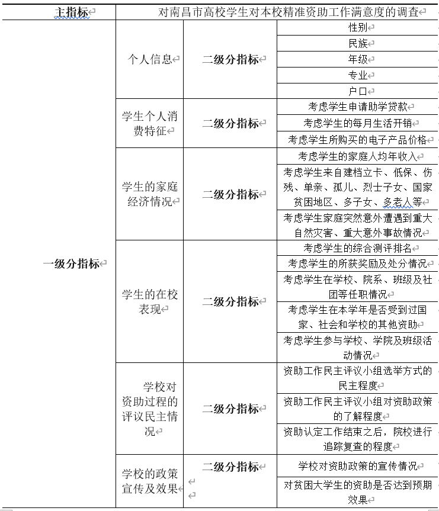
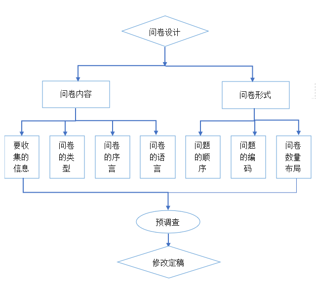
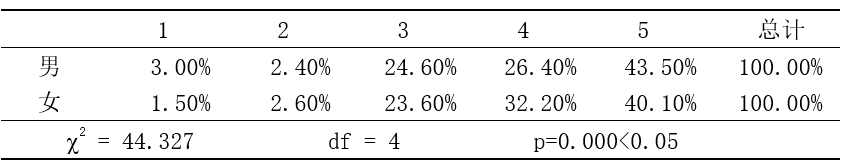
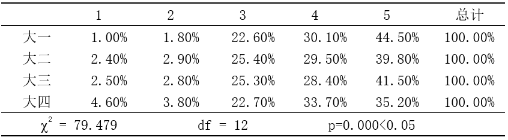
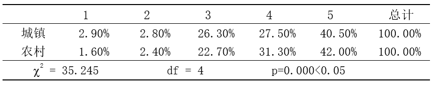
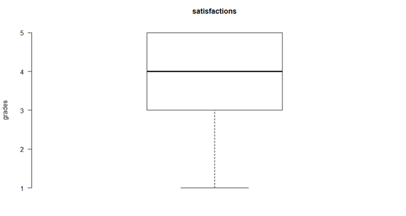
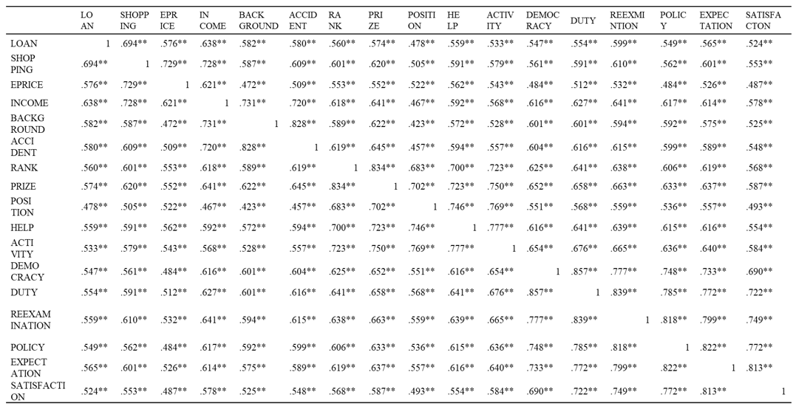
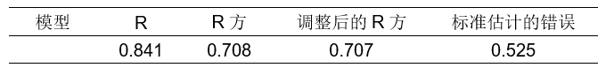
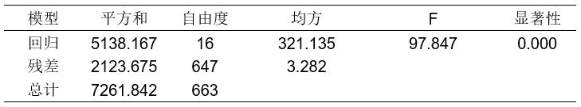
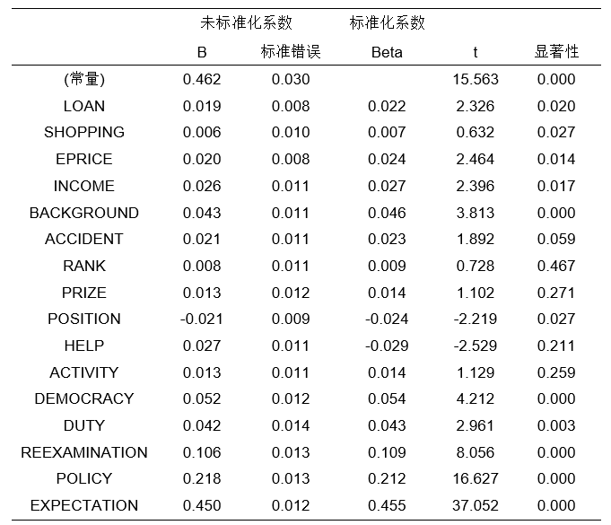

---
title: "大数据背景下高校学生对精准资助工作满意度的调查研究"
author: "陈瑶"
date: "2020年6月"
institute: 中南财经政法大学统计与数学学院
csl: ./style/chinese-gb7714-2015-numeric.csl
css: ./style/markdown.css
bibliography: [./Bibfile.bib]
eqnPrefixTemplate: ($$i$$)
link-citations: true
linkReferences: true
chapters: true
tableEqns: false
autoEqnLabels: false
classoption: "aspectratio=1610"
--- 
```{r setup, echo=F, purl=F}
knitr::opts_knit$set(root.dir = getwd())
knitr::opts_chunk$set(echo = TRUE, results = 'hide')
knitr::opts_chunk$set(warning = FALSE, message=FALSE)
knitr::opts_chunk$set(fig.align="center"
                      ## ,out.width="0.9\\textwidth" # latex
                      ,out.width="60%" # for both latex and html
                      ,fig.width=5, fig.height=3
                      )
```

```{r prepare, echo=F, purl=F}
rm(list=ls())
options(digits=4)
options(scipen=100)
graphics.off()
Sys.setlocale("LC_ALL", "Chinese")
library(reticulate)
```
<center>摘  要</center>

本文以高校学生对精准资助工作满意度为主线，包括满意度指标体系建立，满意度影响因素。本文以问卷调查法为主，辅之以网络调查法，对南昌市本科院校的贫困生进行调查。本文一共选取4所学校，最终发放问卷700份，回收有效问卷664份，有效回收率达到 94.85%，保证了最佳样本量的要求。问卷中各层信度系数都大于0.8，总效度系数大于0.8，问卷结构合理，结果可信；独立性检验表明大部分调查项目之间存在显著相关关系。针对调查结果，文章借助交叉分析、多元回归分析等方法，建立了满意度影响因素模型，并逐步深入、循序渐进地进行分析。

研究发现：南昌市高校学生的平均满意度为4.06高于中性值（3）1.06，说明南昌市高校资助工作实施较好。通过对学生的个人信息分析：女生的满意度普遍比男生高；低年级同学的满意度比高年级同学高；农村高校学生的满意度也要高于城镇户口学生。通过多元回归分析：学校越注重对学生个人消费特征、学生的家庭经济情况的了解，资助过程的评议越民主，学校的政策宣传及效果越好，学生的满意度会增加；而学校是否考虑学生的在校表现，大都不会影响学生的满意度，但如果资助倾向于学生干部，则会对满意度产生负面作用。文章根据结论制定政策建议：国家利用好大数据平台，根据实际情况改进资助政策；高校一方面要落实好资助政策，另一方面要及时获得贫困生的反馈，改进工作；贫困生本身要心怀感恩，利用好信息平台增强专业技能。

<p align="left"><b>关键词：</b></p> 精准资助； 满意度； 高校学生； 交叉分析； 多元线性回归

ABSTRACT

This paper focuses on the satisfaction of college students to the precise funding work, including the establishment of satisfaction index system and the influencing factors of satisfaction. In this paper, questionnaire survey is the main method, supplemented by the network survey method, to investigate the poor students in Nanchang University. In this paper, four schools were selected, 700 questionnaires were issued, 664 effective questionnaires were recovered, the effective recovery rate reached 94.85%, which ensured the requirement of the best sample size. The reliability coefficient of each level in the questionnaire is greater than 0.8, the validity coefficient is greater than 0.8, the structure of the questionnaire is reasonable, and the results are credible; the independence test shows that most of the survey items have significant correlation. According to the results of the survey, this paper establishes a satisfaction influencing factor model with the help of cross analysis, multiple regression analysis and other statistical models, and analyzes it step by step.
The results show that the average satisfaction degree of college students in Nanchang is 4.06, which is higher than the neutral value (3) 1.06, indicating that the implementation of college funding in Nanchang is better. Through the analysis of students' personal information: the satisfaction of female students is generally higher than that of male students; the satisfaction of lower grade students is higher than that of higher grade students; the satisfaction of rural college students is also higher than that of urban registered students. Through multiple regression analysis: the school pays more attention to the understanding of the students' personal consumption characteristics and the students' family economic situation, the more democratic the evaluation of the funding process, the better the school's policy publicity and effect on the school, and the students' satisfaction will increase; while the school's consideration of the students' school performance will not affect the students' satisfaction, but if the funding tends to student cadres, then It will have a negative effect on satisfaction. According to the conclusion, the paper makes policy suggestions: the state should make good use of big data platform and improve the subsidy policy according to the actual situation; on the one hand, colleges and universities should implement the subsidy policy, on the other hand, they should get feedback from poor students in time and improve their work; poor students themselves should be grateful and use the information platform to enhance their professional skills.

<p align="left"><b>Key words:</b></p> precise funding; satisfaction; college students; multiple linear regression analysis 


# 绪论

## 研究的背景和意义

学生资助工作是一项十分重要的保民生、暖民心工程，事关脱贫攻坚，事关社会公平，是帮扶更多的家庭贫困的学生，完成脱贫攻坚的任务，从而达到教育公平。2013年，习近平总书提出了“精准扶贫”重要思想。2014年1月，精准扶贫工作模式的顶层设计被制定出，这推动了"精准扶贫"思想落地。在2016年的两会上以及党的第十九次全国人民代表大会上，习近平总书记都反复强调了“精准扶贫”的重要性。
对于国家来说，实现中华民族伟大复兴的使命将由一代中国青年来接续奋斗，当代大学生无疑是实现中国梦的主力军与后备军，完善好高校资助体系，解决大学生学习的后顾之忧，才能让他们不遗余力，全身心投入与建设祖国的事业之中。当今，建设人力资源强国的关键之一就是做好学生资助工作。建设人力资源强国，是实施科教兴国战略、人才强国战略以及实现中国梦的基石，全体国民的身体素质、科技文化内涵、创新精神与能力都应当要提高。这都和学生资助有关。没有国家学生资助政策，吃不饱或吃不好的现象就很可能在家庭经济困难学生中出现，学生的身体素质和身心素质会受到极大的影响。没有国家学生资助政策，接受学校教育对于这些学生只能是一个梦，也无法谈及所谓的科技文化内涵，创新精神与能力。学生是高校学生工作的服务对象，高校领域的精准扶贫就是要实现对贫困生的精准资助，即对高校贫困学生提供精准而有效的资助，实现真正意义上的“教育扶贫”。如何能够更好的对高校贫困学生进行“教育扶贫”，除了在实施资助工作前深入了解的学生的家庭情况等背景信息，还需要在实施资助工作后，及时的了解学生对精准资助工作的反馈，从而调整工作的方式方法，让精准资助工作得以高效的进行。因此，调查高校学生对学校资助工作的满意度是非常有必要且有意义的。
在当今的大数据背景下，获取能反映学生对高校满意情况的数据更加的快捷和方便，并且能在快速收集信息的同时保护学生的隐私。本文研究充分运用大数据背景下对高校学生的电子问卷调查和纸质问卷调查得来的数据，将数据分析方法引入资助工作当中，一方面有利于丰富精准资助的“教育扶贫”的育人内涵、提升高校资助工作的资助质量以及完善资助的方式。另一方面，通过对高校学生对资助工作满意度的调查，从一定程度上也反映了高校资助工作的落实情况，对高校资助工作本身来说也起到了反馈作用。进而设定更加完善和科学的指标体系，运用适合的评价模型，将影响学生满意度的重要因素挖掘出来，在收集学生信息的同时，采取匿名调查的方式，充分保护了学生的隐私，让学生免去了后顾之忧，能够真实有效的表达内心想法，如此，能够让高校在资助工作中找到着重点，从而更好地帮助学生完成学业。

## 精准资助工作满意度研究现状

### 国内外研究现状

高校学生的发展状况以及资助工作一直以来都受到了党和国家的高度重视，贫困生的发展更是关注的重中之重，如何准确高效的帮助贫困学子完成学业成为了一个重要的任务。随着2013年“精准扶贫”重要思想的正式提出，专门针对高校学生的精准资助工作也开始如火如荼的进行。奖学金、助学金、学生贷款、勤工助学等多种多元渠道共存的高校学生资助政策的体系不断的改进，许多学者对此也进行了深入了研究。不仅如此，要高效精确的帮助贫困学生，更好的完成精准资助工作，一些学者认为需要分析高校学生对资助工作满意情况。基于政策执行的视角，莫世亮使用了问卷法，对浙江省14所高校的贫困生进行了调查，并对这些学校的政策执行的实践信息反馈进行量化分析，探究其满意度的影响因素[@莫世亮2014]。仰玲玲等使用问卷法，对合肥职业技术学院的贫困生进行数据采集，运用模糊分析法，以学生满意度为导向，探索高校资助工作绩效新的评价模型，并通过该模型对该校资助工作从学生满意度角度进行了综合评价[@仰玲玲2017]。鲁瑶对南京江宁大学城６所高校贫困生进行问卷调查，在公平理论基础上设计高校贫困生资助满意度模型，结合工作实践提出系列假设，并用SPSS统计软件验证假设，最后提出管理建议[@鲁瑶2018]。劳家仁分析表明，学生申请态度、宣传的广度与深度、学校认定过程、认定后培养与资助等因素对精准资助的实现起到关键性的作用，建议从影响精准资助的关键性因素入手，制定科学的认定体系，增强认定政策宣传的广度与深度，提升贫困生对资助的认知[@劳家仁2019]。
国外由于政治、经济、文化等各方面的差异，对于贫困生认定再到资金的发放都与国内有着显著的差异，在调查高校学生满意度方面的理论方法也存在着一些差别。不过主体思路都是对高校学生先进行问卷调查采集数据信息，再利用统计分析方法对数据分析，根据样本特征建立合适的模型，从而了解影响高校学生对学生资助工作满意度的影响因素，并根据此提出相应的解决措施与方法。

### 满意度研究存在的问题

虽然从2007年开始，我国就开始建立了奖、助学金、助学贷款、勤工助学等一系列资助渠道，这几年也有诸多学者对资助体系的提高，高校准确的识别贫困生等进行了不少的研究。在思想基础、教育机会等理论方面研究的较多，但实证研究还比较少。此外，学者们对有关资助政策的描述较多，但是对政策执行的量化分析比较少，缺乏政策执行的学生信息反馈。在中国知网（CNKI）以“高校资助满意度”为关键词进行搜索，只有28篇相关的参考文献，并且这些文献大都只是进行了简单的描述性的定性研究，而未对设定的指标进行量化处理。截至到目前为止，高校学生对精准资助工作的满意度及影响因素的研究尚在空白阶段，值得我们进行深入了研究[@陈宗霞2019]。 

## 精准资助工作满意度的研究方法

### 层次分析法

层次分析法的主要思想是将与决策相关联的元素分解成不同的层次，如：目标、准则、方案，随后再进行定性与定量分析。它的特点是深入分析复杂的决策问题的本质、影响因素和内在关系，再运用较少的定量信息，数学化决策思维过程，为多目标、多准则等的复杂决策问题提供简便有效的决策方法。适用于难以准确计量决策结果的场合。
该方法将决策问题按照一定的顺序：总目标、各层子目标、评价准则、备投方案，分解成不同的层次结构，再用求解判断矩阵的特征向量的办法，求出每一层所有元素对上一层的某个元素的优先权重，最后利用加权方法，确定总目标的最终权重，它的最大值便为最佳方案。具有分层性的交错评价指标的系统，且其目标值较多以定性描述的决策问题比较适合运用此方法。层次分析法的步骤如下：

（1）建立递阶层次结构；

（2）构造出两两比较的判断矩阵；两两对比各指标后，按9分位的比率，将各评价指标的相对优劣的顺序给定好，然后按顺序构造出判断矩阵；

（3）根据某标准，将各个备选元素权重计算出来； 

（4）一致性检验。
构造判断矩阵后，用判断矩阵计算出针对某个准则层的各元素的相对权重，并进行一致性检验。在构造判断矩阵A时，并不需要求出判断具有一致性，但是判断偏离一致性大到一定程度也是不被允许的。

### 模糊综合评价方法

模糊综合评价法源自于模糊数学，根据模糊数学中的隶属度理论，将定性评价转为定量评价，即对受到多因素限制的研究对象做出一个关乎总体的评价。该方法结果清晰，系统性较强，能较好地解决模糊的、难以量化的问题，各种不确定性质的问题比较适用。其步骤如下：

（1）指标构建
进行综合评价的基础是模糊综合评价的指标体系，影响综合评价的精准度的关键在于该指标的选取是否合适。因此，了解此评价指标的行业信息或相关的条例法规对于进行评价指标的构建是必要的。

（2）构建权重向量
采用AHP层次分析法或专家经验法构建出权重向量。

（3）构建评价矩阵
构建好评价矩阵的基石就是构造出适合的隶属函数。

（4）评价矩阵与权重的合成
采用合适的合成因子对其进行合成，再解释结果向量。

### 主成分分析法

主成分分析用于探究如何通过原变量的少数几个线性组合来阐明原变量绝大多部分信息，利用降维，基于损失少量的信息下，将多个指标转化成为为几个主成分。从原始变量的协方差阵或相关阵出发，利用原始变量的线性组合，得到几个主成分。这就使得在不损失原始变量大量信息的基础上，起到了简化问题与降维的作用，从而人们在研究较为复杂的问题的时，事物的主要矛盾更能被找出。
利用该方法，一些主要的成分可以从研究对象的复杂关系中被找出，于是可以利用大量的数据，高效的进行定量分析，把变量之间的内在关系给解释出来，得到特征及其发展的一些启发。这个方法能够降低研究对象所处空间的维数，也能利用因子载荷的结论，去弄清一些自变量之间的关系。在筛选变量时，用较少计算量获得最优子集也是可行的[@王静2020]。

### 因子分析法

主成分分析的推广之一是因子分析，降维在该方法上也得到了体现。从原始变量的相关矩阵出发，探究出矩阵内部的依赖关系，再将一些有复杂关系的变量归于几个综合因子。它的基本思想是分析所要研究的变量之间的相关程度，判断相关程度的大小，再据此，将原始变量进行分组，使同组变量间相关程度高，而不同组变量间的相关程度低。其中，用一个不可观测的综合变量来表示每一组的变量所代表的基本结构，即公共因子。关于某个具体的问题，通常用两部分和的形式来替换原始变量，一部分为少数几个不可测的，即公共因子的线性函数，另一部分为特殊因子，与公共因子无关。

### 多元线性回归

多元线性回归模型一般的形式为：

$$y_{i}=\beta_{1}x_{1}+\beta_{2}x_{2}+...+\beta_{k}x_{k}+u_{i},i=1,2,...,n$$ 
<p align="right">(1-1)</p>

其中$k$为解释变量的数目,$\beta_{j}(j=1,2,...,k)$称为回归系数。上式也被称为总体回
归函数的随机表达式。它的非随机表达式为

$$E(Y|x_{1i},x_{2i},...,x_{ki}))=\beta_{1}x_{1}+\beta_{2}x_{2}+...+\beta_{k}x_{k},i=1,2,...,n$$

<p align="right">(1-2)</p>
 
 $\beta_{j}(j=1,2,...,k)$也被称为偏回归系数。

建立多元性回归模型，其假定有:

假定1：随机干扰项零均值假定；

假定2：随机干扰项无序列自相关；

假定3：随机干扰项同方差假定；

假定4：解释变量是非随机变量，且随机干扰项与每一个解释变量无关；

假定5：模型无设定误差；

假定6：解释变量之间无完全的共线性；

假定7：随机干扰项服从正态分布。

### 本文的研究框架和特色

本文通过包括纸质问卷和电子问卷在内的问卷调查的方式，对南昌市四所高校学生进行了数据采集，通过实证分析的方法，将所获得相关数据，利用SPSS进行效度信度分析，确保数据信息的可操作性。详细的研究学校对高校精准资助工作的满意度与学生个人消费特征，学生的家庭经济情况，学生的在校表现，学校对资助过程的评议民主情况及学校的政策宣传及效果五个方面之间的关系。在正确了解国家高校资助政策的前提下，揭示目前高校资助政策所存在的一些问题，和为提高大学生对高校资助工作的满意度提供合适的对策及建议，为提高精准资助工作提供有力依据。此外，目前关于高校资助工作的研究大多是以高校学生贫困认定的指标体系，流程，方法等，对于学生满意度的研究却寥寥无几，因此，本课题研究具有非常重要的意义。

第一章为本文的绪论，主要论述了本文所研究的背景和意义、精准资助工作满意度研究现状包括国内外研究现状和精准资助工作满意度研究存在的问题，精准资助工作满意度的研究方法。

第二章为主要阐述了如何进行问卷调查，数据的收集的过程与数据的处理。

第三章为高校学生对精准资助满意度的分析。首先对预处理后的数据进行信度检验和效度检验，先对学生的主体信息进行分析，如性别、户籍等与学生对资助工作满意度之间是否有所不同，随后对学校对高校精准资助工作的满意度与资助对学生个人消费特征了解情况程度，对学生的家庭经济了解情况程度，对学生的在校表现的了解程度，学校对资助过程的评议民主情况的了解程度及学校的政策宣传及效果五个方面之间的关系应用相关分析，发现自变量与因变量的线性相关程度较高，因此应用多元线性回归模型。通过比较回归系数来判断各因素对满意度的影响程度。

第四章为本文的研究结论以及相应的一些政策建议。


# 数据的收集与处理

## 数据的收集

本次数据的采集主要是通过问卷调查法，样本总体为南昌市全体高校贫困生。问卷的设计如下：

### 问卷指标设计

<center> 表2-1 基本指标分布</center>

<center> 

 

</center>

### 问卷内容设计
本次问卷设计的问题围绕大学生对高校精准资助工作的满意度与学生的个人消费特征、家庭经济情况、在校表现，学校对资助过程的评议民主情况及学校的政策宣传及效果五个方面之间的关系。预调查的过程中发现大多数受访者并不愿意去写简答题，所以本次调查并未设置简答题。

### 问卷功能
 通过改进之后，该问卷的设计较为合理，能够准确反映研究者的调查目的，突出了重点，被访者能够较好的配合调查，具有较好的普适性。
问卷设计的具体流程如图：



<center>图2-1 问卷设计流程图</center>

## 问卷的发放与数据采集

由于客观存在的人力、财力、精力和时间等各个因素的限制，在不影响调查结果的前提下，本文选择主要以南昌市昌北地区普通高等学校为调研对象，选取东华理工大学、江西科技师范大学、江西财经大学、华东交通大学四所大学，以各高校校园的宿舍楼、食堂和图书馆等人流量大的地点作为问卷发放地点，以及通过电子问卷的方式，对这些高校学生进行数据采集。
在调查前期，本人采用预调查法，先设计了50份问卷在学校周围随机发放。通过对回收的问卷进行分析，发现调查问卷的语言要简洁明了，不宜过于繁琐；问卷题目也不宜过多。因此，本人对问题做了一些适当的删减。在调查中期，应用了多种抽样方法，使得调查结果更加真实、客观有效。运用的方式如下：

（1）分层抽样

该方式是选定某种规则或特征，先将总体单位据此进行划分为若干个层，每层内所进行的简单随机抽样就组成了一个样本。本次调查中，首先确定了四所高校的人数比例，据此确定了每个高校发放问卷份数的比例，进行分层抽样。

（2）非概率抽样

在进行调查时发现两大问题：一是几乎无法进行严格的概率抽样；二是基于无限总体的简单随机抽样基本不可实现。
但是总体的离散程度不大，且样本分布较均匀，相似度较大，运用某些非概率抽样(便利抽
样)的结果与概率抽样将具有高度的可替换性。

因此，此次调查采用非概率抽样方式，如判断抽样、便利抽样。我们采用判断抽样对对方是
否是本科贫困生进行自主判断，同时以便利抽样代替简单随机抽样。

以“是否为贫困生”作为样本估计总体的比例，根据样本容量计算公式：
$$n=\frac{Z_{\frac{\alpha }{2}}^{2}pq}{e^{^{2}}}$$
<p align="right">(2-1)</p>
                                                
其中p为是贫困生的比例，$q$为不是贫困生的比例，通过预调查得到贫困生的比例约为0.25，故$p$为0.25，$q$为0.75，显著性水平 为0.05，抽样误差为0.034，依公式（2-1）可得$n$=623,考虑到有些问卷无法回收及会有部分无效问卷等问题，我们计划发放700份问卷。
本文抽样主要是根据学校人数分层，根据四所学校人数比例来确定各层的样本量。通过各高校的官网，查到各高校在校生数量比大概为 7:7:5:6。所以可根据下列公式计算得出各高校应发放的问卷份数：
各个高校的样本量=样本总量*各高校在校生数量比
表2-2问卷分配表

```{r, results='markup'}
frame = data.frame(普通高等学校=c("东华理工大学","江西财经大学","江西科技师范大学","华东交通大学"),问卷份数=c("196","196","140","168"))
knitr::kable(head(frame))
```

本次发放问卷一共700份，其中有效问卷664份。

## 数据处理

首先对问卷中的原始数据进行筛选，确定以下情况不予录入：

（1）调查问卷未填写完或填写不符合实际的选项。

（2）将单选题误作多选的调查问卷。
经过有效筛选，我们最终得到有效问卷664份，问卷有效率达到94.8％。
筛选结果如下表：

<center>表2-3 筛选结果表</center>

```{r, results='markup'}
data = c("700","700","664","94.80%","664")
data = as.matrix(t(data))
colnames(data) = c("发放数目","回收数目","有效数目","有效率","有效总计")
rownames(data) = c("问卷")
frame2 = as.data.frame(data)
knitr::kable(head(frame2))
```

为了方便用SPSS进行分析，需要对数据进行统一的编码。具体的编码规则如下：
对于问卷的选项，以“1,2,3,4,5”代表“A,B,C,D,E”。

 
 
# 高校学生对精准资助工作的满意度分析

## 信度与效度检验

### 信度检验

在一次调查中，测量结果是否可靠、一致、稳定来说明结果的信度，也就是说调查的结果是否如是的反映出被测者的一贯性和稳定的特征。信度只会受到随机误差的影响，随机误差越大，信度越低。如果alpha系数不低于0.7，通常可以认为信度是可以接受的。利用SPSS操作，对学生的个人消费特征、家庭经济情况、在校表现以及学校对资助过程的评议民主情况及学校的政策宣传及效果五个方面及包括总满意度在内的17个项目进行信度分析。

<center>表3-1 信度分析</center>

```{r, results='markup'}
frame3 = data.frame(项目名称=c("学生个人消费特征","学生家庭经济情况","学生在校表现","学校对资助过程的评议民主情况","学校的政策宣传及效果","包括满意度在内的总项目"),项目数目=c("3","3","4","4","2","17"),克隆巴赫Alpha系数=c("0.856","0.863","0.920","0.943","0.897","0.965"))
knitr::kable(head(frame3))
```

根据信度分析结论，5个层面及17个项目的总Alpha系数均超过0.8，这表明该问卷数据的可靠程度很高。

### 效度

有效性就是效度的具体表现，它是指通过一定的方法和手段，能够较为准确测出所要研究的对象的程度。它是指所测量到的结果反映出考察内容的程度，测量的结果与所要考察的内容越接近，效度就会越高;相反，效度就会越低。准则效度、内容效度以及结构效度是效度的三种类型。Kaiser提出，KMO的值应超过0.6。

<center>表3-2 效度检验</center>

```{r, results='markup'}
frame3 = data.frame(项目名称=c("学生个人消费特征","学生家庭经济情况","学生在校表现","学校对资助过程的评议民主情况","学校的政策宣传及效果","包括满意度在内的总项目"),项目数目=c("3","3","4","4","2","17"),KMO系数=c("0.701","0.739","0.88","0.748","0.681","0.965"))
knitr::kable(head(frame3))
```

根据效度分析结论，5个层面及17个项目的总KMO值均超过0.6，总KMO值超过0.9，这表明该问卷的数据是有效的。

## 对调查对象基本信息进行分析

### 性别与满意度交叉分析

<center>表3-3 性别与满意度交叉表</center>



通过对“性别”与“满意度”进行交叉分析，假定“性别”与“满意度”之间具有相关关系，于是进行卡方检验(p=0.000<0.05)后得知，“性别”与“满意度”之间显著有关。
由表可知，男生很不满意人数占男生总人数大于女生很不满意人数占女生总数；在满意和很满意的人数中，女生占比超过男生。这说明女生的满意度要比男生的满意度要高。

### 对年级和满意度的交叉分析

<center>表3-4 年级与满意度交叉表</center>



通过对“年级”与“满意度”进行交叉分析，可以假设它们之间具有相关关系，进行卡方检验(p=0.000<0.05)后得知，“性别”与“满意度”之间显著有关。
由表可知，在很不满意和不满意的人中，大二和大三占比较高，大一占比最少。在很满意和满意中，大一占比最高，大四占比最少。

### 对户口和满意度的交叉分析

<center>表3-5户口与满意度交叉表</center>



通过对“户口所在地”与“满意度”进行交叉分析，可以假设这两者有相关关系，进行卡方检验(p=0.000<0.05)后得知,户口”与“满意度”之间显著有关。
由表可知，相对于城镇户口的高校学生，选择“很不满意”和“不满意”的农村户口的高校学生占比较小，选择“满意”和“很满意”的高校学生占比较大。由此可以得出结论，农村户口高校学生普遍比拥有城镇户口高校学生的满意度高。

## 满意度描述

对满意度绘制箱线图，可以看出满意度的均值大于3。通过计算，南昌市高校学生对精准资助工作满意度的均值为4.06，高于中性值（3）1.06，标准差为0.97。说明高校学生对我国精准资助工作比较满意。


 
<center>图3-1满意度箱线图</center>

## 基于多元线性回归模型分析

### 相关分析

为了解满意度影响因素的大小，本文采用多元线性回归模型进行分析。模型假定所有变量均对满意度有正向影响作用。在对变量进行多元回归分析之前，需要对这些变量之间进行相关性的检验。各变量相关系数表如下：

<center>表3-6相关系数表</center>



**表示在0.01级别（双尾），相关性显著。
从表中可知，各变量与满意度变量之间的相关性显著，因此可以进行回归分析。

### 回归分析

在回归分析之前，要判断各个自变量之间的相关关系是否显著，然后再根据数据的特点来选择一个合适的数学模型，将变量之间的平均变化关系充分的表达出来。容易得知，当资助工作符合学生心中所想，自然学生对资助工作的满意度就会上升。回归方程中的每一个自变量的回归系数是假定其它变量不变的前提下，自变量变动一个单位，因变量的平均变化情况。为研究各个项目对学生满意度的影响，这里采用多元线性回归方程，通过估计出各自变量的回归系数来判定不同项目对学生满意度的影响。在建立模型之前我们假定所有的自变量对因变量的影响是正的。

<center>表3-7 模型摘要</center>



<center>表3-8方差分析</center>
	
　

<center>表3-9 回归结果</center>



方差分析表中，判定系数为0.708，调整后的拟合优度为0.707，说明模型拟合的较好。而在回归分析结果中，发现有一些变量的系数并没有通过t检验，说明有些变量与满意度关系不大。

# 研究结论以及政策建议

## 对主体背景信息的研究结论

（1）女生对精准资助工作的总体满意度高于男生。这在一定程度上反映了江西省资助政策在性别上所体现的教育公平性。另外，女生在学习上比男生更加刻苦，她们在校期间的成绩大多优于男生，因此可以获得相对更多的资助机会，这从某种程度上也解释了性别差异对满意度的影响。

（2）大一的学生的满意度高于其他三个年级。有研究表明，这是因为高年级的学生已经不再同刚入学时具有的“淳朴性”，开始逐渐与社会接轨，更加注重穿着打扮，因此经济压力比大一的同学较大。其中，大四年级还面临着毕业与就业压力问题。因此，高校资助中心应当要更加重视对高年级学生的资助实施，并联合学校相关的心理部门对有困扰的学生进行心理疏导，减轻他们的心理与经济压力。其中对于即将步入社会的毕业生，高校可以尽可能为毕业生联系实习单位，创造尽可能多的工作机会，从而提高高校学生的满意度。

（3）农村户口的高校学生的总体满意度高于城镇户口的高校学生。由于城乡地区之间的差异，两类学生的消费观念和习惯不同，农村户口学生相对来说更为的淳朴，在穿着打扮上面的要求相对来说并没有特别高。对此，高校要时刻教育学生要懂得感恩，不能盲目攀比，不要把精力花在自己的外表，更应该在读书期间勤奋刻苦，增加自己的内涵，要通过自己的努力获得幸福的人生。

（4）满意度均分为4.06，大于中性值（3）1.06，说明高校学生对我国的资助工作比较满意，这也表明我国资助政策体系不仅具有科学性，更具合理性，我国资助工作做的也比较到位。

## 回归分析结果

（1）学生的个人消费情况变量中的有无贷款情况，学生每个月的生活开销以及所购买的电子产品的价格均与假设相符合，能够对学生对资助动作满意度呈现正向影响，在修正后的模型中回归系数分别为0.020，0.006，0.017。说明在高校资助体系如果能对有贷款的同学，每个月消费水平较低（如每月600元以下）以及所购买电子产品价格较低的同学倾斜，可以提高整体高校学生对资助工作的满意度。

（2）学生的家庭经济背景情况与假设相符合。如果学校资助中心在对学生进行资助时，更加重视家庭人均年收入较低、建档立卡、低保、单亲、孤儿、烈士子女、家庭遭到意外变故的学生，则能显著提高整体高校学生对精准资助工作的满意度。

（3）学生在校表现情况变量均与研究相违背。据了解，目前有些高校在对学生进行资助时，或多或少会考虑高校学生的在校表现情况，然而本文的实证分析结果：若高校在进行资助评定时，更多倾向于学生干部，这将会降低学生的满意度，具体表现为资助每向学生干部倾斜一分，学生对精准资助满意度则会下降0.021分。而在校表现的其他变量，对学生综合测评排名的情况、学生在校奖惩情况、学生参加校内活动等情况的回归系数均不显著，说明这些对高校学生对精准资助满意度无关，即高校资助中心在进行工作时，可以不用重点的考虑上述的情况。

（4）学校对资助过程的评议民主情况方面的变量，均与假设相符合。如果学校资助中心在对高校贫困生认定之前，能够公平公正公开的选举出民主评议小组，并且选举出来的小组成员对当前的资助政策的了解程度较高，能够本着客观、实事求是的情况对贫困生进行认定，在资助认定工作结束之后，院校也能够及时的进行追踪复查，这些都将会显著提高高校学生对精准资助工作的满意度。这些正向影响系数分别为0.052，0.042，0.106。

（5）学校的宣传及效果情况变量中，与研究假设一致。正向影响系数分别为0.216，0.449。这说明高校要想把精准资助给真正做好，就必须加大对资助工作的宣传力度，保证每一个贫困学子对国家资助的政策都能较为了解，从而可以让每一个贫困生能够安心学习，减轻贫困学子家庭的经济负担，免去他们的后顾之忧。

## 政策建议

### 国家层面

2020年我国将全面脱贫,步入小康社会。对于高校贫困生国家更加需要重视。最为重要的一点，便是要把不让一个贫困学生失学的理念一直贯彻下去。对于工作的开展，也要与时俱进，要充分利用好大数据平台所提供的各种信息平台，及时了解关于资助中心工作的反馈，合理的调整与更新国家资助政策，尽可能的方便贫困学生进行贫困认定。坚决做好“顶层设计”，在资助政策上更加合理化，以便于高校精准资助工作的开展，符合本国国情。

### 高校层面

在大数据时代下，高校在响应国家资助政策的同时，也要利用好信息数据平台，有效率的进行精准资助工作的实施。如通过对学生一卡通消费，校内银行卡消费等情况，建立贫困生个人消费信息库，从而高校可以较为准确的了解学生的个人消费情况，也为鉴定学生是否为“真贫困”提供依据；利用贫困生所在地的信息库，来判断贫困生的家庭类型，通过对贫困生本人及其家庭成员就医记录，来得知学生及其家庭成员的身体健康状况，从而知道学生的家庭经济背景信息；学校在进行资助过程中，要尽可能的确保公平，及时对贫困生周围的同学了解相关信息，在选举民主评议小组的同时也要尽可能做到科学、民主；在进行贫困认定的时候，由于数据化的便利，贫困生的个人信息很有可能会被泄露，这在无形之中会增加贫困生的心理压力，对此，高校在利用数据化平台的便利之时，也好保护好贫困生的个人隐私；此外，高校还要不断的宣传国家资助政策，并及时的对反馈做出行动，确保精准扶贫工作落到实处。

### 贫困生层面

对于贫困生来说，虽然无法决定自己的出身，但是有国家这个大后方为自己解决上学了后顾之忧，自己应当要努力学习，不辜负国家，学校，家长对自己的期望。与此同时，高校贫困生应时刻心怀感恩，要合理的使用国家助学金以及其他补助，把国家给予的帮助用在学习上，提高自己，而不能产生盲目的攀比现象，陷入拜金主义，这样就辜负了国家、学校的一片苦心；此外，高校贫困生也应当在大数据时代抓住机遇，不能做只读圣贤书的书呆子，应该要利用好网络媒体中等免费的学习资源进行学习，也许还能从中找到创业的机会。
 
# 致  谢

首先，由衷感谢我的论文指导老师，东华理工大学理学院的彭萍老师。在撰写论文的过程
中，彭老师对我的研究方向提出了不少的指导性的意见并且当我遇到的一些问题和疑惑的时
候，彭老师都及时的给予了我悉心指点，提出了诸多的改善性建议，投入了老师特别多的时
间与精力。对此，向彭老师予以最诚挚的感谢！同时，我也要特别感谢东华理工大学理学院
的老师们和同学们，大家在完成毕业设计的过程中相互学习，相互帮助，共同进步。

其次，在我创作过程中，朋友们家人们始终给我加油打气，也经常帮助我一起查找相关资料，这都给我带来了不少的启发。此外，我也要向参考文献的作者们致谢，正是因为通过他们的文章，我才有了一些好的想法，有了前进的动力。
最后，想对论文评阅老师们道一声辛苦了，感谢各位老师的辛苦付出。也再次感谢帮助过我
的所有人，正是因为有这样一群人做我坚实的后盾，我才得以顺利完成我的毕业论文。 


# 参考文献
[//]: # (\bibliography{Bibfile})

# 附录


	　	　

