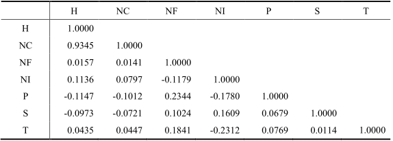

```{r setup, echo=F, purl=F}
knitr::opts_knit$set(root.dir = getwd())
knitr::opts_chunk$set(echo = TRUE, results = 'hide')
knitr::opts_chunk$set(warning = FALSE, message=FALSE)
knitr::opts_chunk$set(fig.align="center"
                      ## ,out.width="0.9\\textwidth" # latex
                      ,out.width="60%" # for both latex and html
                      ,fig.width=5, fig.height=3
                      )
```

```{r prepare, echo=F, purl=F}
rm(list=ls())
options(digits=4)
options(scipen=100)
graphics.off()
Sys.setlocale("LC_ALL", "Chinese")
library(reticulate)
```

**摘要：**随着知识付费的蓬勃发展，各种付费平台的快速崛起，在保证更多的用户参与体验的同时，知识付费产品面临着由量到质的转型。因此，探究知识付费背景下用户对平台内容的消费倾向在大数据时代具有重要意义。本文以知乎Live 热门讲座为研究对象，运用网络爬虫技术爬取热门讲座的相关属性及其讲者信息，首先对已爬取的数据进行描述性统计分析，再进一步应用文本挖掘、多元回归分析、因子分析、结构方程模型等方法对当前付费产品的特征和影响知识付费产品销量的因素进行深入分析，从而进一步研究付费用户对平台知识产品的付费倾向。结果显示：我国知识付费产业整体规模呈稳定增长趋势，但知乎 Live平台用户规模占总行业的比例仍较小；用户对提升生活品质和提高自身能力的讲座需求较强，对知识科普型 Live 讲座的需求较弱；知乎 Live 讲座的销量普遍不高，且购买讲座的付费用户与讲座主办者的互动水平一般；知乎 Live 平台的信息不对称问题较为明显，潜在消费者一般选择以低价产品作为体验对象；讲者声誉、推广趋势、产品属性都对 Live 讲座的销量有正向影响，且推广趋势对销量的影响程度最大。在此基础上，对付费平台的营销方式和知识提供者的产品完善方向提出了针对性建议。

**关键词：**知识付费；消费倾向；网络爬虫；多元回归分析；结构方程模型

# 绪论

## 研究背景

2016 年，被称为知识付费元年。该年，喜马拉雅 FM、知乎、得到、果壳等知识付费平台相继出现，知识付费产品层出不穷、面临井喷。2016 年，知识付费的用户迅速增长，用户达到近 5000 万人（根据企鹅智库、果壳网等多项报告估算）[@张立吴素平中国新闻出版研究院2020]。

刚开始，知识付费被认为是头部自媒体的商业模式，“割韭菜”或者“忽悠”之类的批评相当激烈，但自 2018 年以来，越来越多的互联网平台纷纷把知识付费作为其与用户之间深度运营的一种获利模式，并尝试根据产品所服务的用户特性不同，针对性地提供特色知识产品，知识付费不仅没有因质疑而停滞不前，反而发展得愈发繁荣，用户规模达到近 3 亿人  。

2019 年，知识付费在量上降温反而在质上加强突破，逐步成为整个互联网行业的发展趋向，用户消费从碎片化形式转变为兴趣图谱化，知识付费从与知识弱相关转变为强相关，知识付费内容越愈发丰富多样。在《中国在线知识付费市场研究报告》（2018）中艾瑞咨询预测，在定价、时长、人才等因素综合作用下，2020 年中国知识付费产业规模预计能达到 235 亿 [@艾瑞咨询2018] 。

知识经济的兴起对产业结构、投资模式、教育职能与教育形式等产生了深刻的影响，在线经济、网络经济、电子贸易等新型产业也大规模兴起。

当然，知识付费飞速发展的同时也带来了一连串新问题。知识产品作为一种独特的体验型产品，效用函数难以确定，在信息不对称的情况下消费者不易在付费之前有效地对知识付费产品的质量进行判断。研究表明，12.3%知识付费的消费者表示不满意，49.7%表示使用感受一般，而研究数据同样表明知识付费产品的打开率和复购率并不理想，这在一定程度上阻碍着整个知识付费行业和相关平台的发展 。除此之外，知识付费产品销量的两极分化也十分明显，在知乎 Live平台上，有些场次的 Live 参与人数高达 10 万人，但也有许多 Live 无人问津  。这些低销量的Live中虽然不乏劣质的伪知识产品，但也可能包含很多优质产品，只是因为在知识交易过程中存在信息不对称的问题，导致用户难以有效地获取知识产品的质量信号。

基于以上，针对目前消费者不易对知识付费产品进行有效的质量判断、对知识付费产品的打开率和复购率总体偏低、知识付费产品销量两极分化等问题，开展本次研究。

## 研究意义

（1）以知乎 Live 为例，通过分析其收益增幅和活跃用户数的波动情况，有利于深入探究知乎 Live 等收费平台的有效盈利模式以及知乎付费平台的发展潜力与发展方向；

（2）通过探究影响平台用户消费倾向的各类因素，分析用户对付费内容的消费倾向，从而帮助知乎 Live 平台更精准地对产品销量进行预测，更有效的分配运营资源、设计知识产品展示界面，使知识交易过程更加高效快捷；

（3）同时对知识提供者提供建议，引导其更好地凸显产品特点，产出品质与销量“双保证”的知识付费产品。这将为推动“知识付费”模式的成熟以及对用户知识获取的正向引导做出重要贡献。

## 文献综述

随着自媒体的发展、移动端内容的丰富与打赏制度的出现，消费者对优质知识付费产品认可度和消费意愿逐渐提升，与此同时催生了大批产品用户和内容生产者的知识付费平台。目前知识付费行业的发展仍处于早期阶段，存在着知识付费体验不高、用户复购意愿较低、缺乏针对知识付费产品内容的评价体系和筛选体系等问题，这将对知识付费的大背景产生消极影响，不利于行业的发展进步。针对此类问题，国内外的各界学者对此进行了以下几方面的深入研究。

**1.知识付费平台的使用与推广具有较高的时代价值与市场价值。**

张立（2020）认为当前传统媒体行业规模增长缓慢，自媒体的整体格局不会轻易发生改变，垂直专业人才的发展受到限制，知识转播方式势必面临“洗牌”。
随着共享经济的火爆发展，用户能够获取的信息资源逐渐丰富，碎片化的学习方式也成为缓解知识焦虑的潮流。同时，加上人们付费意愿的逐步提升，版权意识的逐渐增强，促使付费平台成熟发展。因此，陈海鹰等（2019）认为这是问答双方各取所需、实现共赢的过程，具有时代价值与市场价值，其本质值得肯定[@陈海鹰2019]。

**2.社会化网络问答社区与传统在线问答社区存在差异性。**

从知识产品提供者的角度出发，Yan等（2017）认为传统的在线问答社区依靠虚拟金币等方式激励优质回答，知识产品提供者获得的收益模式较为单一。而在社会化网络问答社区中，用户的社交属性的增强使其知识贡献行为也发生变化。

首先，刘子齐等（2017）的研究结果表明知识产品提供者拥有精英社区的归属感，其贡献知识主要出于利他主义，而非虚拟的等级或勋章；其次，知识产品提供者社区声誉的获得主要依赖于平台用户的认可（例如粉丝数、点赞数、收藏数等）；第三，利用较好的社区声誉可持续经营平台账号，以高质量的产品回馈关注者，同时自我积累以此吸引更多的关注。

**3.用户在判断知识付费产品的质量优劣方面尚有一定难度。**

研究表明，知识付费产品销量的两极分化较为明显。在知乎Live平台上，有些场次的Live参与人数高达10万人，但也有许多Live无人问津。

蔡舜（2019）等认为这些低销量的Live中虽然不乏劣质的伪知识产品，但也可能包含很多优质产品，只是因为在知识交易过程中存在信息不对称的问题，导致用户难以有效地获取知识产品的质量信号[@蔡舜2019]。与此同时，邓胜利等（2020）的研究证实大部分商家平台对潜在付费用户的信息掌握较为匮乏，往往容易忽略一些关键因素（如用户之间的交互行为能显著影响其付费行为等），导致用户无法借助平台方获取更多的有效信息，知识产品的变现能力难以突破[@邓胜利2020]。

因此，分析知识付费产品消费者决策过程，探究知识付费产品的质量信号具有重要的现实意义。

**4.个人影响因素与感知价值影响因素是两个主要的付费动机。**

个人影响因素是指影响付费行为的知识付费用户自身特性，例如可支配收入、道德标准、年龄、付费经验、性别、付费态度等；感知价值影响因素是指能够影响付费倾向的知识付费用户感知行为，一般包括感知费用、感知有用性、感知易用性、感知娱乐性、感知风险等。

Goyanes（2014）的研究表明，用户的人口统计变量（收入、年龄和性别）、社交媒体使用状况（推特）以及其他付费产品的购买满意度会对该用户的付费新闻购买意愿产生一定影响[@Goyanes2014]。另一方面，Wang等（2005）的研究指出，用户可感知的商品价值，如重要性、便利性、商家提供的服务质量以及附加价值，都对其付费意愿有正向影响，而订阅过程中感知的不公平性对其付费意愿有负向影响。

综上所述，虽然学者们对于当前知识付费行业的现状和供给者的分享动机进行了多角度的阐述和分析，但关于平台付费用户的付费动机与倾向的相关研究仍较为有限。为此，本文运用网络爬虫技术，以知乎Live为例，收集平台相关付费产品数据，运用多种统计、数据挖掘等数据分析方法，探究分析用户对平台付费内容的消费倾向，从而进一步对知识付费整体行业及相关人员提供意见与建议。

# 样本的描述性分析

## 数据收集与项目名称

本次调查采取网络爬虫的数据收集方式，获取知乎Live界面十一类话题领域所对应的热门讲座及其相关信息，共计220例。通过爬取所得的文本数据与数值型数据进行建模分析，探究用户对付费内容的消费倾向。网络爬虫所爬取的Live讲座信息表如下所示：


## 样本基本情况分析

### 十一类话题领域的平均热度排行


由上图可知，在知乎Live的十一个话题领域中，乐活、成长、职人这三类话题的平均热度位列前三名，均高于20k，说明知乎付费用户对提升生活品质和提高自身能力的需求较为强烈。与之相较，文学、前沿、科学、社科这四大类的平均热度均低于10k，侧面反映出知乎付费用户对知识科普型Live讲座的付费倾向较弱。

### 十一类话题领域的Live定价情况


如上图所示，绝大多数知乎Live讲座的定价水平集中在9.9~20元的价格区间内，少数主题领域定价稍高，但几乎都控制在百元以内，反映了在当前阶段，大多数知识付费用户和潜在消费者对平台产品仍处于保守的态度，不愿花费过高价钱购买试用，Live讲座知识提供者普遍倾向以低价来吸引用户，从而刺激用户消费的积极性。

### 热门Live讲座简介关键词分析


根据网络爬虫结果，我们将220个热门知乎Live讲座的文字简介整理在文本文档内，运用R程序绘制词云图如上。根据词云图所示，在十一类话题领域中，主题一中，“学习”、“方法”、“技巧”、“经验”、“入门”等词生成的概率较高，说明当前知乎付费用户对专业知识和经验方法的分享类讲座的关注度与付费意愿较强。因此，知乎平台付费用户的主要群体应该是刚进入社会的职场菜鸟和承受过高学习压力的学生，其付费动机绝大多数是为了提高自己的职业竞争力和学习效率。

# 探究销量影响因素的多元回归分析

为了分析知乎Live讲座的相应属性中影响其销量的主要因素，利用Eviews软件对220例网络爬虫样本数据进行多元线性回归分析，采用普通最小二乘法进行参数估计，在排除多重共线性、异方差对公式的影响后，最终得到知乎Live讲座销量的多元线性回归模型，并对影响Live讲座销量的因素进行分析。

## 多元回归模型的数据选择

根据知乎网页提供的可爬取信息，我们通过Python网络爬虫初步得到以下可能会影响讲座销量的数值型变量：销量、热度/k、语音时长/min、定价/元、平均评分、附加服务项目数、评论数量、讲座讲者粉丝数量。其中，热度是指知乎Live讲座上架以来的用户浏览量情况统计，附加服务项目数取值范围为1、2、3，包括“可无限回听”、“可按章节收听”、“七天无理由退款”。下文模型中，将销量、热度/k、语音时长/min、定价/元、平均评分、附加服务项目数、评论数量、讲座讲者粉丝数量分别表示为Q、H、T、P、S、NI、NC、NF。

## 多元回归模型的建立

### 模型的初步建立

为了分析知乎Live讲座的相应属性中影响其销量的主要因素，首先绘制以销量为纵坐标，其他变量分别为横坐标的散点图如下所示：


由上图可以看出，知乎Live讲座的销量与热度和讲者粉丝数量之间有明显的线性关系，与其他变量之间的关系也趋于线性。因此，初步判定销量与七个变量之间的关系可能是线性的。

将销量作为被解释变量，其他相关变量作为解释变量，构建多元线性回归模型。模型为：

$$Q=C+C(1)×H+C(2)×T+C(3)×P+C(4)×S+C(5)×NI+C(6)×NC+C(7)× NF$$

其中，C为常数，C(1)~C(7)为Live讲座属性的相关系数。通过Eviews软件利用最小二乘法得
到模型参数，具体数值为：

$$Q=1.2972-2.0136×H-0.6297×T-1.1877×P+15.9988×S-1.3514×NI+1.1070×NC+0.0008×NF$$

该模型修正的可决系数为0.9950，说明模型的拟合效果非常好，根据F检验的F=6192.0370，远大于临界点，也说明模型整体显著。但是H、T、NI系数的符号与预期相反，且在显著性水平为0.05的条件下，解释变量T、P、S、NI均不通过t检验，这表明变量之间可能存在多重共线性。

### 多重共线性的修正

对所有相关性变量进行相关系数矩阵计算，结果如下表：



由表可知，热度（H）与评论数量（NC）之间高度相关，价格（P）与讲者粉丝数量（NF）之间存在弱相关，语音时长（T）与附加服务项目数（NI）也存在弱相关。

根据AIC准则利用R语言进行逐步回归，得到消除多重共线性后的线性回归模型，其公式为：
$$Q=22.3576-1.0993×P+1.0688×NC+0.0008×NF$$

在0.1的显著性水平下，剩余解释变量均通过t检验，可决系数非常高，Prob(F-statistic)=0.000，且变量的系数符号符合预期，说明改修正模型可取。

# 探究销量影响因素的结构方程模型分析

## 因子分析 

本项目通过对影响知乎Live讲座销量的相关变量进行效度分析和因子分析，并对这些变量进行精简和降维，得到三个因子。


由上表可知，KMO值为0.559，Bartlett值为826.898，自由度为36，P值为0.000，说明爬虫样本总体效度处于较高的可接受范围内，即样本数据适合做因子分析。经验算，将语音时长/min、定价/元、平均评分、评论数、热度/k、赞同数、喜欢数、收藏数这8项指标转化为得分均值，以因子载荷为权重，浓缩成3个因子影响程度指数，解释的累计方差占73.728%。


由因子分析结果可知，影响知乎Live讲座销量的因子可概括为三点：讲者声誉因子、产品属性因子、推广趋势因子。

## 模型的假设

观察数据，认为讲座销量数与Live讲座标题内容、简介与讲座上架时长存在一定联系，例如上架时间过短会导致销量过少，关于两性知识标题容易吸引更多热度与评论等，为了更加有效地进行定量研究，筛选并剔除极端样本，将剩余201例样本数据进行标准化，构建结构方程模型。

与此同时，在阅读并研究相关报道与文件中，可以了解到知乎Live等知识付费平台的信息不对称问题较为明显，往往会出现劣质产品驱逐优质产品的现象，从而使平台知识付费产品平均质量下滑。因此，有效评估知识付费用户的消费倾向将直接影响讲座的销量与平台口碑。

结合知乎平台实际提供的可量化数据，本章采用因子分析结果的三个因子作为潜变量，购买人数作为内生变量，建立假设，并绘制影响知乎Live讲座销量各因素的结构方程模型如下图所示：


H1：知乎Live讲座的产品属性对其推广趋势有正向影响。

产品属性整体越好，说明产品所对应的语音时长、价格、平均评分都高，其反映的是Live讲座的整体质量。知乎Live讲座的综合质量越好，其推广趋势也会越好。

H2：知乎Live讲座的推广趋势对其讲者声誉有正向影响。

H3：知乎Live讲座的讲者声誉对其销量有正向影响。

H4：知乎Live讲座的产品属性对其销量有正向影响。

H5：知乎Live讲座的推广趋势对其销量有正向影响。

## 模型的构建

### 初步模型的构建

本文利用 AMOS 24.0画出模型的路径图。按假设将隐变量与显变量的关系以及潜变量之间的因果关系设置好后，通过使用最大似然估计方法，运行得到了模型路径图，同时返回标准化回归系数的估计值如下图所示：


图中符号说明：矩形表示的是观测变量（即指标）；椭圆表示的是潜变量（即因子）；圆表示的是残差（测量误差）；单向箭头表示单向影响（因果关系）；双箭头表示相关（非因果关系）。

### 模型的初步评价

1.路径系数/载荷系数的显著性。运行得到的是路径系数的估计结果，如下表所示。


从结果中可以看到，所有路径的估计系数均的 P 值均小于 0.1，路径在 0.1的显著水平下达到统计学意义上的显著性。

2.模型拟合评价。本文模型的拟合优劣指标汇总如下表所示。


拟合结果显示，本模型的某项拟合指数并不理想。P值小于0.05，可见初步模型存在一些问题，拟合度不佳，因此需要对模型进行修正，建立新的模型使其与数据更加适配。

## 模型的修正

下面在卡方值差异量MI指数较高的变量残差e2和e4之间建立相关关系来减小模型卡方值。因此考虑MI值修正后的模型如下图所示。


得到拟合系数表如下表所示：


从表中可以看出，卡方值减小，与自由度之比小于3，P值大于0.05，RMSEA值小于0.1，GFI、NFI、CFI等值向1靠近，拟合度更佳，各拟合指数都基本达到拟合要求。修正后的模型已基本符合适配标准，模型的整体拟合度有了较好的改善，也更具有指导意义。因此，将本模型确定为最终的结构方程模型。

## 变量影响效应分析

最终修正模型得到的标准化路径系数和部分参数估计如下表所示：


通过对修正后的结构方程模型输出结果进行分析，对五项假设做出检验如下：产品属性对其推广趋势有正向影响（β=0.194，P<0.05），原假设路径H1成立；推广趋势对其讲者声誉有正向影响（β=0.195，P<0.05），原假设路径H2成立；讲者声誉对其销量有正向影响（β=0.074，P<0.05），原假设路径H3成立；产品属性对其销量有正向影响（β=0.038，P<0.05），原假设路径H4成立；推广趋势对其销量有正向影响（β=0.976，P<0.05），原假设路径H5成立。

根据以上分析结果，可以认为：讲者声誉、推广趋势、产品属性都会直接和间接地影响知乎Live的销量，由标准化路径系数所示，推广趋势对其销量的影响程度大于讲者声誉、产品属性对其销量的影响程度。因此，知乎平台应加强对优质付费产品的推广力度，利用大数据分析用户的喜好与需求，准确推送适合他们个人的知乎Live讲座，同时，讲座主办者也应利用自身的声誉影响力宣传并提供更加优质的产品，达到与付费用户的互利共赢。

# 主要结论与建议

## 主要结论

**1.我国知识付费产业整体规模呈稳定增长趋势，但对知乎Live平台而言，其付费用户规模占总行业知识付费用户规模的比例仍较小。**

根据华经情报网数据可知，自2016年起，我国知识付费产业整体规模程稳定增长趋势，短短三年时间产业规模从26.5亿元增长到250亿元，虽然产业规模增速走向平缓，但这也从侧面反映一些高质量的知识付费产品逐渐取代低质量的同类产品，整个知识付费行业正在努力以量变为基础追求质变。

在竞争激烈的新兴付费平台中，知乎Live付费用户规模占总行业知识付费用户规模的平均比例仍比较小，仅为2.29%，因此知乎Live平台亟需采取有效方案积极吸引普通用户向付费用户转移，并增强付费用户的忠诚度，同时加快在知识付费市场站稳脚跟。

**2.知乎付费用户对能够帮助提升其生活品质和提高其自身能力的Live讲座需求较为强烈，对知识科普型Live讲座的需求较弱。**

在知乎Live的十一个话题领域中，乐活、成长、职人这三类话题的平均热度均高于20k，受欢迎程度排在前三名，与之相较，文学、前沿、科学、社科这四大类的平均热度均低于10k，说明知乎付费用户对提升生活品质和提高自身能力的Live讲座需求较为强烈，而对知识科普型Live讲座的关注度较弱。

从Live讲座简介关键词构成的词云图中也可以知道，当前知乎付费用户对专业知识和经验方法的分享类讲座的关注度与付费意愿较强。因此，可以猜测知乎平台付费用户的主要群体应该是刚进入社会的职场菜鸟和承受过高学习压力的学生，其付费动机绝大多数是为了提高自己的职业竞争力和学习效率。

**3.知乎Live讲座的销量普遍不高，且购买讲座的付费用户与讲座主办者的互动水平一般。**

根据220条网络爬虫得到的样本数据显示，各类话题领域的热门Live讲座对应的评论数量集中在100-999条和100条以下（分别占总样本的46%和36%），而1000条及以上的占比仅为18%。由此可以推断当前知乎Live平台的绝大多数非热门讲座的评论数远小于100条，这说明较多Live讲座的销量都不高，且知乎付费用户在与Live讲座和讲座主办者的互动水平一般，平台应鼓励、支持、引导付费用户参与评价，建立有效互动机制。

**4.知乎Live平台的信息不对称问题较为明显，潜在消费者一般选择以低价产品作为体验对象。**

绝大多数知乎Live讲座的定价水平集中在9.9~20元的价格区间内，少数主题领域定价稍高，但几乎都控制在百元以内，反映了在当前阶段，大多数知识付费用户和潜在消费者对平台产品仍处于保守的态度，不愿花费过高价钱购买试用，Live讲座知识提供者普遍倾向以低价来吸引用户，从而刺激用户消费的积极性。然而，付费平台的信息不对称问题往往会导致劣质产品驱逐优质产品的现象，从而使平台知识付费产品平均质量下滑。

**5.讲者声誉、推广趋势、产品属性都会直接和间接地影响知乎Live的销量，且推广趋势对销量的影响程度最大。**

根据结构方程模型的分析结果可知，讲者声誉、推广趋势、产品属性都会对Live讲座的销量有正向影响，与此同时，推广趋势对讲者声誉有正向影响，产品属性对推广趋势有正向影响，因此各个方面的完善都可以提升付费平台的收益水平，其中推广趋势的影响效果最显著。然而根据样本数据显示，平台仍存在大量低热度知识产品，平台推广力度有待加强，应着重聚焦开拓推广方式。

根据多元线性回归模型的分析结果可知，Live讲座的价格对其销量有负向影响，因此低价销售是一个合理的方案，而Live讲座的评论数量与讲者粉丝数量对其销量有正向影响，因此平台应积极鼓励付费用户反馈购买使用情况，讲座主办者也应利用自身知名度，提升并不断完善知识付费产品的品质，吸引更多的关注者转向付费平台。

## 主要建议

### 对付费平台的建议

**1.适当进行补贴促销，提高付费用户忠诚度，同时吸引新用户。**

研究表明，潜在消费者一般选择以低价产品作为体验对象，红包补贴与折扣促销往往能够刺激普通用户的消费积极性，带动普通用户转型。因此，知乎Live等付费平台可以采取低价激励方针，以补贴和促销的方式吸引普通用户向付费用户转移，同样这也能在一定程度上增强现有付费用户的忠诚度，有助于平台在知识付费市场站稳脚跟。

**2.建立有效互动机制，积极鼓励用户对付费知识产品内容进行反馈。**

对知乎Live而言，其Live讲座的销量普遍不高，且知乎付费用户在与Live讲座和讲座主办者的互动水平一般，这将使讲座主办者缺少对知识产品完善的思路与方向，平台应建立有效互动机制，鼓励、支持并引导付费用户参与评价，反馈真实的购买使用情况与满意程度。

**3.合理利用大数据，分析用户的喜好与需求，开拓灵活多样的推广方式。**

研究表明，推广趋势对Live讲座销量的影响最为显著，因此平台应着重聚焦推广方式的灵活性与多样性。付费平台不缺乏的专业知识分子提供优质的知识付费产品，但缺少合理的营销手段将这些产品推荐给需要的用户。因此，付费平台应该利用大数据分析用户的喜好与需求，准确推送适合用户个人的知乎Live讲座，达到与付费用户的互利共赢。

### 对付费产品提供者的建议

**1.不断完善自身产出的知识付费产品的品质，提升个人声誉号召力。**

研究表明，讲者声誉和产品属性对知识付费产品的销量均有正向影响，但标准化系数不大，反映付费产品提供者的个人影响力仍有待提升，消费者对其名下的知识产品的信任度有待增强。

因此，讲座主办者需要不断提升并完善其名下知识付费产品的品质，优质的知识产品将能增强个人声誉的效用价值，随后利用自身知名度，吸引更多的关注者转向付费平台，培养长期购买的忠实度，达到与付费用户的互利共赢。

**2.既要迎合大众对付费知识的需求与喜好，也要追求开创独具匠心的新颖话题领域，做到知识分享的均衡多样。**

从Live讲座简介关键词构成的词云图中可知，当前知乎付费用户对专业知识和经验方法的分享类讲座的关注度与付费意愿较强，目前该类知识付费产品并没有面临井喷，因此需要知识产品提供者的广泛加入，使用户都能搜寻匹配到与个人需求相似度高的付费产品，从而提升用户活跃度。

在知乎Live的十一个话题领域中，文学、前沿、科学、社科这四大类知识科普型的平均热度均较低，冷门话题领域并不代表没有收益前景，关键是要依靠知识产品提供者对复杂繁琐知识的加工能力，减少晦涩难懂的概念科普，加入一些幽默元素，往往能另辟蹊径，杀出一条血路。 

因此，知识付费产品提供者应对自己的分享内容有合理的规划与思考，拒绝盲目扎堆于热门话题领域，应广泛涉猎，精准投入。

# 参考文献
[//]:(\bibliography{Bibfile})
