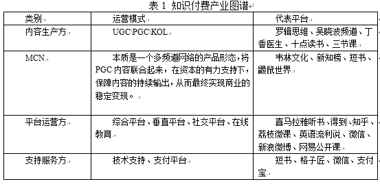

**摘要**

互联网环境下的知识经济从萌芽到现在，依旧有着高速发展的势头，在这发展的期间也出现
了许多优质且特点鲜明的知识付费产品，“薛兆丰的经济学课”就是其中之一。本文将以天价
经济学课程——“薛兆丰的经济学课程”为例，先梳理有关知识经济的文献研究，然后从经济学
的角度出发，基于成本、需求、供给分析，阐述知识经济的产生原因、发展现状，并研究天
价经济学课程的成功模式，为对知识经济之后的发展提供建议。

**关键词**

知识经济，知识付费产品，天价经济学课程

2017年2月20日，“薛兆丰的经济学课”在得到APP上线，周一到周五每天更新，每节课时长十
到十五分钟，由北大经济学教授薛兆丰为用户亲口讲述经济学基本原理及应用，课程周期一
年，订阅价格为199元。70天后，订阅数就突破十万。预计收入超过1000万元。截至2020
年，订阅人数已超48万。薛兆丰也因此成为了富有的经济学家。在最初的时候，“得到”的创
始人罗振宇邀请他来做主播，薛兆丰并没有同意。虽然课程时长只有十多分钟，但这背后所
需要的材料却需要达到三四千字，这对于仍在北大做教授，每天教学任务还很繁重的薛兆丰
来说，实在是忙不开。后来，他跟随著名经济学家周其仁前去“罗辑思维”参观，罗振宇将自
己的想法详细的告诉了薛兆丰，这才促成了“薛兆丰的经济学课”这门课的诞生。相比于以往
人们印象中的音频课，栏目负责人要求薛兆丰像是对着一个不懂经济学的人讲课一样进行录
制，因此，课程由于生动有趣并且对于没有经济学基础的人也很适用，在正式上线之后得到
了广泛的好评。而“薛兆丰的经济学课程”的走红，不仅仅是薛兆丰本人的功劳，还在于课程
背后的平台——“得到”APP在讲课方式以及平台运营上的独到见解。

在“薛兆丰的经济学课”成功之后，越来越多的知识付费平台涌现出来。例如，以用户需求为
起点的用户生产内容模式——知乎；以专家、专业主播团队或专业机构入驻生产内容的专业生
产内容模式——优酷合伙人计划；以专业内容生产者与用户内容生产者的结合模式——喜马拉雅
FM。层出不穷的知识付费产品使得我国知识经济不断得到发展，并且随着互联网环境的不断
优化，知识经济也迸发出了更多值得研究的内容。

# 文献综述

总体来讲，知识经济的研究文献主要是针对知识付费、共享经济等方面，从不同的角度来剖
析，给出知识付费的定义，大致有以下几个角度： 

从传媒角度来看，[@何亮莉2018]何亮莉将知识付费定义为知识的传播者在自身技能、经验
和认知的基础上，将其打造成一个系统且理论化的标准化收费产品，通过个人或平台传播出
去。[@张远帆2018]张远帆思考了该课程背后的传播逻辑、商业逻辑和产品逻辑，探寻优质
知识付费产品的要素，进一步厘清传媒、出版和教育的融合趋势。[@李炜娜2018]李炜娜认
为互联网知识经济本质上是内容付费与知识共享的一种形态。网络知识平台看似搭建了营销
的经济平台，实则是深度介入知识加工的生产角色，这些生产者不仅包括台前的知识明星大
V，也包括更广泛的知识生产和消费群体。网络付费知识的内容生产重构了社群化知识平
台。

从社群经济角度来看，漆美玲认为社群经济视角下的知识付费就是互联网时代利用信息差，
将信息包装成产品通过网络售卖。[@漆美玲2019]

从服务的角度来看，王时光认为，知识付费这一概念中的“知识”侧重的是“转化为产品和服
务的知识”，而不是单纯的知识本身。[@王时光2019]

从知识经济学的角度来看，赵静宜、程明认为传统主流经济学将知识视为难以定价、不能交
易的公共资源。而这是经济学认为知识可以被交易并且应该在市场上进行交易，只有在市场
自由竞争体系中，通过价格机制的协调，才能够激励个体的隐形知识显性化，进而将散落在
不同个体脑海中的隐性知识协调起来。[@赵静宜2019]

从产业的角度来看，叶宗乐认为互联网知识付费是消费主体在消费升级后形成的一种以互联
网上的知识产品和服务为消费对象，直接为其付费的消费行为及习惯。目前，知识付费产业
在中国已初步形成了“生产者——交换平台——消费者”的完整闭环。而互联网知识产业从完全免
费模式到部分知识付费模式转变的背后，是知识产品和服务的供需关系围绕价值逐渐优化。
[@叶宗乐2018]

还有一些文献是对知识付费产品收费模式以及盈利模式的研究：[@冯红霞2018]冯红霞指出
了目前知识付费的盈利模式仍然不明确，知识付费想要获得长远的发展，必须从盈利模式上
找到突破口。[@包丽薇2017]包丽薇则以“分答”为例，分析其盈利模式以及对于知识付费未
来发展的意义。

目前来说，对于知识经济的研究鲜有运用基本经济学理论来进行分析的，本文将从经济学最
基本的三个角度分析知识经济的产生、现状，阐述其产生与蓬勃发展的合理性。并结合薛兆
丰的经济学课程这一事例，总知识付费产品的成功模式，并对知识经济的永续发展提出建
议。

# 互联网知识经济的产生

经济学家肯尼思•艾瓦特•博尔丁于1966年提出知识经济学，主张研究知识的商品属性，知识
的生产、交换和消费就成为一个独立的经济学问题开始被大众研究。知识被视为可以进行独
立生产和交易的商品。随着科学技术的不断创新，知识经济学也不断的丰富起来，研究对象
也在不断地发展变化。

现代知识经济的概念最早明确提出于《以知识为基础地经济——经济合作与发展组织（OECD）
1996年年度报告》，将知识经济定义为基于知识和信息生产、分配和使用的经济。而随着互
联网产业的发展，知识经济与互联网融合，形成了当下的互联网知识经济。互联网知识经济
的本质就是知识内容付费与知识共享，其产生的原因有以下几点：

1. 互联网平台的不断优化为知识经济奠定了基础
   4G时代的到来，让人们对于网络应用的获取更加的便捷，自媒体行业不断壮大，互联网
   已经渗入到了人们生活的各个角落。根据工信部2020年3月发布的《2020年1-2月通信业
   经济运行情况》，我国4G用户规模达12.62亿户，占移动电话用户总数的79.9%。移动互
   联网的发展为知识付费产品的获取以及知识付费平台的搭建奠定了基础。如今是互联网
   高速发展的阶段，通过知识付费产品提供的多种环境，消费者对于高质量的知识的需求
   不仅可以得到满足，又可以通过交互优化学习的氛围，从而提升体验感受。
2. 知识付费观念深入人心
   随着互联网内容行业的发展以及如今版权保护的强化，人们的付费的意识也在不断加
   强。从各音乐平台对音乐专辑实行付费制以来，人们的意识从“网络上的是免费的”开始
   转变为“付费是对创作人版权的保护”，并逐渐延伸到知识付费行业。
3. 移动支付平台的崛起
   对于互联网知识付费产品，如果没有移动支付平台是无法进行实际消费的。由于移动支
   付的便捷以及易操作性，使得人们更愿意使用线上支付，这就为知识付费搭建了桥梁。
4. 人们的认知盈余
   克莱•舍基对于认知盈余的定义是：受过教育并拥有自由支配时间的人，他们有着丰富的
   知识背景，与此同时又有着强烈的分享欲望，这些人的时间汇聚在一起，产生了巨大的
   社会效应。在此背景下，知识付费应运而生。最初的生产者就是有着丰富的知识背景以
   及倾诉和分享的欲望的人。

# 互联网知识经济的现状及原因分析

2016年被广泛认为是知识付费的元年，以知识付费产品为主要盈利模式的互联网平台开始兴
起并迅速发展，诸如知乎Live、喜马拉雅FM、得到、分答。随着视频、网站等付费会员制度
的建立、数字付费音乐专辑的推出、线上教育的不断完善，网民也逐步养成为优质互联网内
容买单的习惯。

从用户体量上来看，数据显示，截至2019年，中国知识付费行业用户规模达3.6亿人，行业
市场规模达278亿元。艾媒网报告中指出，中国在线学习用户中88.8%购买过知识付费产品，
以80后与90后为主。46.8%的知识付费用户每月花费500-2000元购买知识付费产品，82%的用
户认为其购买的知识付费产品比较符合或完全符合期望，九成用户表示会再次购买知识付费
产品。

从行业角度看， 根据艾媒网《2020年中国知识付费行业运行发展及用户行为调研分析报
告》，知识付费产业主要包括以下几个部分（见表1）。

内容生产方和平台运营方都可以直接向用户提供知识收费产品，内容生产方也可以通过与平
台运营方合作，作为知识付费平台中的一个小分支向用户提供知识；MCN方不直接作用于用
户，而是作用于内容生产放和平台运营方，通过资本支持，保证内容的持续输出；支持服务
方则是作为一种支撑，保证其他三个平台正常运作以及提供支付的平台。

知识付费产品的支付模式也呈现多元的面貌，大致可以分为以下几种模式：

1. 订阅合辑付费模式

用户通过订阅感兴趣的内容生产者生产的付费合辑获取知识，这种付费合辑一般课程周期
长，定价通常也较高，对于用户的要求也较高。

2. 单次付费模式

可分为查看付费和付费回答两种，查看付费是指付费查看已经生成的内容，而付费回答是指
付费指定内容生产者回答具体的问题。

3. 打赏模式

用户可以自由选择是否付费以及付费金额的大小，这种模式下内容生产者的现金收入较不稳
定。

4. 授权转载付费模式

用户对于内容生产者所生产的知识产品进行商业转载或者引用时支付一定的转载费用。

从经济学的角度来分析知识经济的现状可以发现，知识付费产品基本遵循市场经济中的成本
——收益规律，但具有特殊性，并且知识付费产品的规模经济效应不明显，甚至有反规模经济
效应。对于互联网知识经济的现状的产生原因可以从经济学角度即成本、供给和需求三个方
面来分析。

## 成本分析

产品的成本由其生产要素的价格决定。一般产品的生产要素主要有土地、劳动力和资本。而
由于知识付费产品处在双边市场中，双边市场中的平台企业向知识提供者与消费者提供产品
或服务，所以平台成本是产品成本的重要组成部分，直接影响产品的供需和价格。除此之
外，还包括内容成本、生产成本、劳动力成本。

### 平台成本

随着互联网平台发展到Web3.0时代，我国互联网基础建设不断进步，知识付费产品所需要的
平台搭建不再像以前那样耗费资金以及精力。同时，大数据时代的到来，平台搭建以及平台
运营所产生的大体量数据也能用计算机进行管理。除此之外，我国的风险投资和融资体系不
断得到完善，平台建设的投资渠道日益丰富，使得成本不断地降低。2016年之所以成为互联
网知识经济的元年，不仅仅是因为人们对于知识付费的需求增长到了一定程度，还因为我国
互联网技术不断成熟以及投资环境的改善等综合作用引发了平台成本下降。

### 内容成本

知识付费其实就是内容付费。经济学中最基本的假设是经济人假设，即以完全追求物质利益
为目的而进行经济活动的主体。从这个角度来看，知识付费最开始的形式——UGC（用户生产
内容）就是以降低内容成本为目标而产生的。从知识经济学角度来看，社会中的知识包括显
性知识与隐性知识。显性知识是指通过教育系统所传播的系统性知识，隐形知识是指存在于
个体大脑中的不被主流社会所知的碎片化知识。UGC这种形式通过将内容生产者和内容消费
者合二为一，将个体中的隐性知识挖掘出来，其内容成本接近于零。但随着越来越多的人参
与进来，有用信息与无用信息混合在一起，使得UGC模式的边际收益越来越低，由此催生了
PGC（专业生产内容）。虽然PGC模式在成本上高于UGC模式，但由于其在知识上的专业性，
致使PGC模式的边际收益大于边际成本，也是符合经济人假设的。边际收益不变的条件下，
降低边际成本会增加利润，故后来产生的PUGC模式（用户和专业共同生产内容）是UGC模式
的改进。

### 生产成本

对于知识付费产品来说，并不需要形成最终的有形产品，而是用数字内容来呈现，因此生产
成本很低。这种特性吸引了一群想要分享自身隐性知识的人，由此催生出例如自媒体一样的
存在。

### 劳动力成本

在传统的知识传播途径中，报刊和书籍是最主要的载体。其生产和物流运输在其成本中占比
很大。在互联网知识经济中，知识的传播几乎是零成本的。但是，在成功的知识付费产品背
后，平台的运营也是很重要的影响因素。运营对于从业人员的知识水平以及技能水平都有很
高的要求，因此相应的劳动力成本大幅提升，劳动力成本也就成为了知识付费产品的核心成
本。虽然互联网的发展会使知识付费产品的平台成本逐渐下降，但是人们对于产品的质量要
求则会越来越高，劳动力成本会持续上涨，在成本中所占的比例会越来越大，进而成为成本
的主要部分。

## 需求分析

### 人们对于碎片化知识的需求

如今的社会的竞争越发激烈，许多职业都需要人们不断地学习获得与时俱进的技能，而由于
本身工作就已经很忙碌，很多人无法有足够的时间去进行系统性的学习，因此利用碎片化时
间进行学习来提升自己就成为了大势所趋。而碎片化知识可以通过手机电脑等便携设备获
取，使得人们可以利用休息时间学习，首先催生出了免费获取知识阶段，而随后到了海量信
息混杂的阶段，高质量与低质量的碎片化知识并存，进而又催生出了知识付费阶段。

### 人们对于解决从海量信息中提取有用信息的需求

在信息及大数据时代，互联网每分每秒都在产生数以万计的信息。在免费获取碎片化知识的
阶段，人们自行搜索所需要的信息，但由于网络的发展，越来越多的人在互联网上进行分享
信息，这也就产生了信息质量参差不齐的问题。人们希望能够直接便利地获取自己需要的信
息，并且愿意为此支付一定地费用以降低机会成本，从而催生了知识付费。

### 人们对于技术发展所带来的新鲜知识的焦虑而产生的需求

科学技术已经渗入每个人的生活，并且在不断地发展，新知识也在不断地出现，相应的旧知
识也在被淘汰。由此人们会产生一种知识焦虑，为了减少这种焦虑感，人们会通过在互联网
上搜集信息并进行学习的方式跟紧时代，这也成为了知识付费的需求之一。

## 供给分析

知识作为商品经历了从严重不足到严重过剩的历程，互联网知识产业从完全免费模式到部分
知识付费模式转变的背后，是知识产品和服务的供需关系围绕价值逐渐优化。

### 免费供给时期

在互联网发展的初期，网络平台建设速度是高于内容生产的速度，如果是普通的商品，这时
应该表现出价格上涨的态势，但由于互联网的特殊性，这种价格上涨并不直接表现在获取网
上知识的价格上涨，而是在上网费用居高不下方面得到体现。所谓“流量经济”就是以网络流
量本身的价值以及与之相应的宣示、广告等价值共同产生的经济价值。免费供给其实并不是
真正的免费，而是由其他厂家或其他形式支付费用。此时的内容供给是严重不足的。

随着网络技术的发展，人们越来越容易接触网络，网上的内容生产迅速的过剩，但在这个阶
段，人们由于种种原因对于这种泛滥的信息的需求并没有增加多少，这就使得上网流量价格
的下跌。但即便如此，海量信息依旧过剩，内容生产的边际收益趋近于零。对于一般的商
品，边际收益过小时，会减少生产要素的投入，降低产量。但对于互联网的信息而言，用户
的增多必然会导致内容生产变多，此时就催生了新的内容供给方式。但UGC模式由于其价格
低廉而且门槛较低，依然是重要的内容供给方式，仍然对知识付费产品的价格形成具有一定
影响。

### 付费供给时期

免费供给时期不断发展，冗余信息越来越多，而有价值的信息和无用信息一起呈现在人们面
前，导致无效供给大于有效供给，人们迫切需要一种可以直接提供有用信息的方式，由此直
接催生了知识付费。通过付费的方式，知识付费从“流量经济”转向了“内容经济”，迅速弥补
了有效供给的不足。

但知识付费阶段并未能刺激出更多的需求，这表现在知识付费初期爆发式增长，但随后就出
现了瓶颈，大部分的知识付费产品流量都有所下跌。现在，知识付费又从泛化知识向垂直领
域转变，从满足弹性需求向满足刚性需求转化，从提供泛化知识向提供精准知识转化，把传
统的刚性需求转化为知识付费需求。

# 天价经济学课程的成功模式分析

结合互联网知识经济的现状分析可以发现，知识付费的垂直化发展是当下所需，而天价经济
学课程就是处在发展潮流之中的。除此之外，还要很多可以值得借鉴的优点。可以将天价经
济学课程的成功模式分析总结为以下几点：

## “薛兆丰的经济学课程”的课程模式

知识付费产品根本的呈现形态更接近于教育产品，如果“薛兆丰的经济学课程”里没有教育的
思维，那么该课程仅仅是薛兆丰按照稿子读出来的有声书籍，也就不会有后来的“天价经济
学课程”。既然核心是一门课程，那么主讲人和消费者之间就需要有交互的关系。主讲人的
角色类似于老师，通过网络的形式代替课堂上面对面的交流，也能够达到像在课堂上学习的
作用。

如果说对于知识付费产品的批评大多是批评其传播碎片化的知识而非系统知识，那么“薛兆
丰的经济学课程”的成功就恰恰在于课程设置的体系化。该课程在刚一上线的时候就公布了
全年课程的教学大纲，结构严谨、循序渐进。并且在开篇就引出了经济学的四个基本问题，
通过薛兆丰独特的与现实生活事例相结合的讲课方式，深入探讨隐藏在简单生活背后的经济
学现象，对于经济学的入门者来说是非常友好的。

除了系统化的课程模式优点，该课程还有一处特点，就是它的开放性。就如同在学校里进行
学习一样，“薛兆丰的经济学课程”并不是他一个人完成的，它需要用户共同参与。该课程每
节课后都会留下思考题，并在下周进行答疑，并且每周还会有一道辩论题，留给用户通过留
言的方式进行辩论。而通过留言，不仅使得用户可以进行思维发散，对于内容生产者来说也
是一种学习的过程。这也是教育产品的真谛。在传统的视频课或音频课中，用户只是一个被
动接收的角色，学习状况如何以及有什么疑问都不会得到关注，使得用户很容易觉得这些课
程太“高高在上”，无法融入。而“薛兆丰的经济学课程”则是真正的把用户当作学生来看待，
让用户更容易从学习中获得乐趣和归属感。并且在课程结束的时候，还选拔优秀学员，并为
他们提供一些大公司的面试机会。虽然可能只是一种营销策略，但从这个意义上来说，“薛
兆丰的经济学课程”就是独一份存在的，它实现了知识付费产品从线上到线下的转变。

## “得到”APP的平台运营模式

“薛兆丰的经济学课程”的成功固然有他个人魅力的原因，但也离不开“得到”APP的运营模
式。

在“得到”APP产生之前，先有的是免费自媒体《罗辑思维》。主创人罗振宇以个人幽默的语
言风格圈粉无数，并且同时运营罗辑思维的微信公众号以及罗辑思维官方旗舰店。罗振宇本
人、《罗辑思维》、罗辑思维微信公众号以及官方旗舰店者四者是互相联系在一起的，满足
了用户多方面的需求，因此也吸引了一批又一批的忠实用户。这些都为得到APP的成功奠定
了基础。

得到APP于2015年5月上线，主打省时高效的碎片化学习阅读。在《罗辑思维》时期，我们就
能够发现一个非常鲜明的运营特点：注重与用户之间的互动性。彼时节目中罗振宇自称罗
胖，经常回答听众的问题，并且制造直接对话听众的情景，甚至还有些节目的主题也是听众
选择的。后来的得到APP中，薛兆丰的产品经理也认为与用户的互动是整个课程的有机组成
部分。这个运营特点是得到APP的产生与发展的基础。

平台与自媒体之间也是在互动的。得到APP上最成功的免费课是《罗辑思维》，最成功的付
费课是《薛兆丰的经济学课程》，最能体现这种品牌运营模式的，就是这两个栏目之间也会
经常性的互动，彼此成就。

平台和用户也是互动的。在品牌运营方面，得到APP有一个非常特别的活动，就是坚持每周
二晚8点直播例会，这个活动已经成为了一种传统。例会的主旨是：直播开例会；有事公开
说，做一个透明的公司。得到APP的用户大多是大学生群体和创业人士，直播例会不仅仅可
以增强用户对于品牌的了解度，帮助大学生了解公司是如果运转的以及给创业者提供一些有
用的样本，还能够建立品牌形象，为得到APP吸引人才。

在产品的运营方面，得到APP是先有产品后付费，因此可以把经历主要放在产品的打磨设计
上。薛兆丰曾在采访中谈到，他首先需要对着他的产品经理讲一遍，然后再把录音转换成文
字进行修改，然后再在录音棚自己录制；需要将课程内容变得即深刻又易懂，将生活中的现
实例子与知识点相结合；而且需要将时长控制在十分钟左右，这样可以让大家一次性听完；
并且每周五都需要回答用户的问题。这几个方面的设计使得《薛兆丰的经济学课程》能够脱
颖而出，成为将网课转变为自媒体脱口秀的标杆。与此同时，罗振宇也将自己的《罗辑思
维》朝着薛兆丰课程方向改进，使得得到APP有了自己独特的性格。

# 知识经济发展的趋势及建议

从天价经济学课程的走红以及“得到”APP的运营模式中，可以看出知识经济需要围绕着用户
的需求不断发展，并且由此我们可以总结出一些知识经济发展的趋势。

## 专业化内容生产

根据艾媒网《2020年中国知识付费行业运行发展及用户行为调研分析报告》显示，用户在购
买知识付费产品时考虑的因素主要有：内容生产者的专业度（47.8%）、内容生产者的口碑
（36.0%）、内容生产者的知名度（29.7%）、平台的知名度（27.9%）、产品的价格
（26.1%）以及其他一些因素，但都不超过20%。由此我们可以看出，在现阶段购买知识付费
产品的时候，用户主要会考虑内容生产者的专业度、口碑、知名度等，这些因素意味着这个
产品是否值得信任值得购买。知识付费行业发展前期主要依靠网红大V、KOL的个人IP效应来
吸引粉丝，但他们的创作内容都比较浅显，并没有专业的体系。现阶段，人们更多的关注内
容本身，知识付费产品依靠其专业度来吸引用户。

## 垂直化细分市场

随着越来越多的内容生产者进入知识付费行业，与此同时也带了一些问题，比如同质化越来
越明显以及内容质量明显参差不齐。现阶段深度学习的用户需求变多，不进行垂直化发展就
会导致用户黏性降低。垂直化、细分化已经成为知识经济发展的一个大趋势。天价经济学课
程就是一个细分化的产品，它专注于想要经济学入门的人群，这些人想要在自己的工作中增
加经济学的思想但并不需要过分的深入，因此天价经济学课程既有质量又能够满足特定需求
的人群。

## 专属定制

除了垂直化细分化这一趋势，专为特定用户定制产品的趋势也逐渐明显。比如一些制定穿衣
风格、妆容风格的公众号，他们就是通过专属定制的方式来为每个用户讲解关于服装和妆容
搭配的知识，并收取相应的费用，相比于垂直化更能精准的满足个体的需求。这也正体现了
知识经济的价值所在。

对于内容生产者来说，知识经济的发展趋势使得产品价值不断深化，因此生产者需要做到知
识价值的深度挖掘。比如可以进行先相关知识拓展、将线上产品与线下服务增值结合以及可
以把目光转到企业团体知识学习中去。

对于知识付费平台来说，想要提升平台价值，需要跟紧技术的脚步，可以通过加大技术投
入，更好的了解用户的行为和需求，重视消费者的价值选择。在产品质量保证的基础上，可
以优化使用场景增加用户黏性，让用户在满足知识需求的基础上有更好的操作体验。并且可
以通过与其他平台合作，比如电商平台，可以实现线上与线下的完美结合；或者与社交平台
结合，维系社群经济。除此之外，新兴的知识付费平台数量越来越多，综合电商型、垂直行
业型、社交融合型平台均有很多家，但消费者并不需要过多的知识付费平台，因此平台兼并
重组为主的竞争方式可能很快就会到来。

而对于媒体、出版和教育行业等传统行业而言，知识经济是大势所趋，能够抓住知识付费的
机会，对于传统行业转型具有很大的意义。媒体注重传播，出版注重的是知识产权，教育注
重的是学习过程。而天价经济学课程的例子告诉我们，媒体、出版和教育的融合是一个优质
的知识付费产品的必备的特质。而从宏观上讲，知识经济的发展预示着媒体、出版和教育三
者在跟随着互联网的发展进行融合。这种融合是传统行业的创新性发展。媒体行业从前依靠
广告收益的模式发生了变化；传统行业相比知识付费行业效率低下的弊端也使其必须要转型
升级；互联网知识经济对于教育行业的冲击主要体现在教育机构这方面，如果教育机构能够
利用互联网开发出具有机构特色的知识付费产品，可能有助于取得新的发展。

# 参考文献
[//]:(\bibliography{WY})
