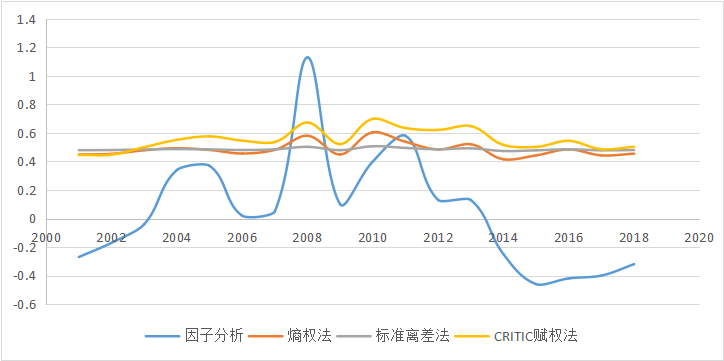

```{r setup, echo=F, purl=F}
knitr::opts_knit$set(root.dir = getwd())
knitr::opts_chunk$set(echo = TRUE, results = 'hide')
knitr::opts_chunk$set(warning = FALSE, message=FALSE)
knitr::opts_chunk$set(fig.align="center"
                      ## ,out.width="0.9\\textwidth" # latex
                      ,out.width="60%" # for both latex and html
                      ,fig.width=5, fig.height=3
                      )
```

```{r prepare, echo=F, purl=F}
rm(list=ls())
options(digits=4)
options(scipen=100)
graphics.off()
Sys.setlocale("LC_ALL", "Chinese")
library(reticulate)
```

<center>
摘要
</center>

系统性金融风险的度量和识别一直以来都是国际学术界交流和研究的重要热点，在当前经济全球化进一步发展、国际市场广泛密切交流合作的背景下，度量我国金融风险，维护经济形势稳定更具有重大意义。

本文以我国金融风险的测定为对象，第一部分首先分析我国当下的经济背景以及风险问题，进一步通过查阅资料了解到近些年国内外对系统性金融风险度量问题的研究现状、测定方法等，提出建立金融风险指数模型的探索研究。

第二部分首先从宏观经济风险、银行市场、资产泡沫风险、外汇市场这四个角度分析金融风险影响因素，选取了 CPI 增长率、GDP 增长率、人民币存贷款比率、平均市盈率、不良贷款率、房地产投资增长率、外债偿债率等 21 项指标，构建我国系统性金融风险指标体系，然后选取各指标从 2000-2019 年各年度的数据，再对其进行无量纲化处理，最后采用 SPSS 进行因子分析建立金融风险指数模型。再分别利用熵权法、标准离差法、CRITIC 赋权法求得权重，并计算出我国2001-2018 年的金融风险指数。

第三部分首先分析了我国系统性金融风险自 2000 年来呈现先升高再降低、随后又缓慢增加的变化趋势，然后将因子分析和常规客观赋权法对风险指数度量进行对比研究，得出因子分析建立的金融风险指数模型拟合精度更高，反映风险变化的波动程度更大，更具有敏感性，最后结合当前经济背景提出降低我国系统性金融风险的建议和措施。

**关键词**：金融风险；因子分析；客观赋权法；SPSS；评价指标体系

# 引言
近些年金融危机在世界范围内多次爆发，金融业在经济发展中发挥着越来越重要的作用，系统性金融风险的度量和识别成为国家专家和学者交流研究的热点问题。当前我国面临经济变革转型的新形势下，经济体系不断发生变化，对外交流合作正在逐渐扩大，使得我国金融体系的脆弱性进一步加重，同时也增大了我国系统性金融风险爆发的可能。防范化解金融风险成为重中之重，维持金融系统的稳定不仅能促进金融业的繁荣发展，还可能影响国家政治、经济、社会、文化生活等方面的发展。

由于我国对金融风险度量的研究起步较晚，目前国内对金融风险问题的研究还不够成熟，在系统性金融风险识别预警的模型和方法上没有形成一致的看法，构建一套基于我国当前经济形势，能综合度量系统性金融风险的风险指数模型，对稳定金融系统和经济体系具有重要的现实意义。

国内已有的研究主要集中在层次分析法、熵权法、CRITIC 赋权法等主客观赋权方法确定指标权重,构建风险压力指数，但层次分析法、专家打分法这类主观赋权法采用主观打分评估，人为确定评判标准，评估结果缺乏一定的准确性和客观性。本文基于此问题，首先综合选取金融风险评价指标建立指标体系,通过因子分析构建金融风险指数模型，对我国的金融风险进行风险度量；其次利用三种常规客观赋权法分别计算金融风险指数，将其结果与采用因子分析的测定结果进行对比，比较对金融风险拟合效果的差异之处；最后对我国当前金融风险的发展情况进行综合评估并预测未来风险发展趋势，提出加强对金融风险的监测预警的有效措施，防范和化解金融风险。

# 绪论
## 选题背景及意义
### 选题背景
20 世纪 90 年代以来，世界各国甚至全球范围内经历了多次金融危机，比如日本泡沫危机、东南亚金融危机、美国次贷危机以及 2008 年全球金融危机等，造成企业破产、工人失去工作、经济形势动荡不安等一系列严重后果，导致一国甚至全球的经济和金融急剧衰退。
  
现阶段我国正处于经济转型新阶段，经济体系不断变革，逐步扩大对外市场的开放交流，我国金融领域面临着巨大的风险和挑战。由于我国金融业对国外市场进一步开放，与其他各国之间的经济贸易往来更加密切。国际资本流动、人民币利率和兑外币的汇率不断波动增加了我国经济发展的不稳定性；同时由于近年来中国的房地产市场动荡、影子银行、地方政府赤字增大等领域问题频频出现，进一步加重了金融体系的脆弱性，从而使我国系统性金融风险爆发的可能性增大。如果控制不当就可能引发系统性金融风险,逐步演变为金融危机甚至是经济危机，将会给我国乃至世界带来巨大灾难。

### 选题意义
目前，我国经济迎来“新常态”发展的崭新阶段。一方面，在国家宏观经济方面，我国经济面临着结构性放缓、外部市场环境复杂且严峻的压力，因此当前和今后较长时期内经济工作的重点是保持我国经济持续稳定向前的发展进程；另一方面，金融市场出现异常波动，股票和房地产市场较为动荡，地方政府性债务风险等问题更加突出，经济体系不稳定，经济发展形势依然严峻，系统性金融风险爆发的可能性明显增大。近几年国家召开的经济会议和下发的文件中，政府强调要不断完善我国金融监管体制，加强金融监管机构对金融风险的监测力度，坚决防范系统性金融风险的发生，顶住复杂经济环境的压力，保持经济持续健康发展[@洪昊2011国际收支风险监测预警研究综述及对我国的启示]。

在国内外经济不确定性持续增加的新形势下，对系统性金融风险的研究已成为各国政府和学者关注的重要课题。系统性金融风险不仅会导致国家的宏观经济发展形势动荡，甚至会影响到国家的福利政策和社会财富状况，防范系统性金融风险已成当务之急。构建一套基于我国当前经济形势且而且能综合度量系统性金融风险的风险指数模型，对稳定金融系统和经济体系，进而实时、直观地监测和预警我国金融风险具有重要的现实意义，同时有利于各监测机构和部门提高监管水平，及时采取措施控制金融风险，稳定我国金融体系。

## 文献综述
### 国外文献综述
国外对系统性金融风险的研究主要集中在风险的识别和测度模型上。Blaschke、Jones 等人于 2001 年提出了压力测试方法并用于金融部门评估计划；2002 年 Moorthy 和 Perraudin 以滞后的经济形势为基础，选取大量金融市场的交易数据，提出了 Simple Logit 模型；2003 年 Iling 和 Liu 首次提出金融压力指数的概念,并于 2006 年构建了系统性金融风险压力指数，进行实证分析研究；Tarashev 等人在 2009 年提出 Shapley 值分解法；2012 年Brownlees-Engle 研究金融市场严重衰退背景下的金融风险指数的构建，并确定了系统性金融风险评价体系的各项指标；2016 年 Adrian 和 Brunermeier 考虑一对多个金融机构的影响和整个金融市场的风险溢价这两个方面，提出了基于 VaR 的 CovaR 方法，并根据当前金融风险的趋势预测未来风险发生的可能性。

### 国内文献综述
我国对系统性金融风险度量和识别的研究起步迟于国外研究，前期的实证研究主要集中在货币危机的预警识别方面，后期更侧重于金融风险指标体系的建立和金融压力指数的构建方面。

2002 年唐旭通过对中国金融危机综合预警指标的理论分析和对测度方法、模型的定量分析，提出了中国金融风险预警系统的构成框架并进行实证研究，预测了金融风险发生的可能性；谭中明在 2010 年将影响区域金融风险的因素分为内部和外部两个方面，然后根据选取的指标运用层次分析法和熵值法度量金融风险；2011 年陈守东和王燕分析了中国金融压力指数与行业一致性综合指数之间的动态关系，并预测了 2011 年的金融压力指数的走势；2014 年孙立新采用等权重法构建了包括银行市场、证券市场、房地产市场以及外汇市场在内的 8 个指标的金融压力指数，并利用压力周期来衡量金融体系的稳定性；胡宗义、刘研伊在2017 年通过分析金融风险影响因素构建中国金融压力指数，采用 CRITIC 赋权法度量中国金融体系的风险[@师家升2019中国金融风险预警指数的构建]。

## 研究目的与方法
### 研究目的
国内外学者对系统性金融风险的识别和度量过程类似。首先进行理论分析，对风险的产生机制进行了研究；然后搜集大量数据进行定量分析，提出测定和评估风险的模型和方法。本文以当前中国经济形势为背景，在深入了解国内外对金融风险一系列理论和实证研究的基础上，通过构建金融风险指标体系，进而建立金融风险指数模型，对我国系统性金融风险进行综合评估。不仅可以更好地识别各个年度时期的风险波动水平，也有利于对我国的系统性金融风险进行实时监测和预警，维护金融体系稳定。

### 研究方法
①文献研究法，使用万方、中国知网、维普等渠道查阅金融风险以及模型构建的相关文献，熟悉文献内容，进而全面准确把握所要研究的问题；

②数据调查法，通过国家统计局等官方网站搜集所需要的数据；

③模型分析法，针对所要研究并解决的问题建立适当的数学模型；

④对比分析法，将金融风险度量所采用的不同赋权方法进行对比，得出最优的金融风险指数模型。

## 研究内容
本文研究新经济形势下我国系统性金融风险的度量，并建立金融风险指数模型，研究的主要内容如下：

（1）金融风险指标体系的构建，根据指标选取的系统性、科学性、实用性和可行性原则，综合分析形成中国金融风险的影响因素，选取适当指标构建金融风险指标体系；

（2）金融风险指标数据的处理，搜集并整理各指标 2000-2019 年的数据，对各类数据进行同向化和标准化处理；

（3）金融风险指数模型的构建，根据选取的指标，利用因子分析构建金融风险压力指数模型，同时采用常规正向客观赋权法(熵赋权法、CRITIC 赋权法、等方差加权法等)进行金融风险度量；

（4）系统性金融风险指数结果的分析及预警，分析我国金融风险压力指数的走势，综合比较各方法对我国系统性金融风险的识别的拟合效果，并对我国系统性金融风险进行预警识别。


# 构建金融风险指标体系
## 指标选取
为了建立科学有效的系统性金融风险模型对风险进行识别和度量，首先要综合分析影响金融风险的各种因素，构建准确的金融风险指标体系。筛选出适合有效的指标变量减少无关变量的干扰，而且能够客观全面地反映各市场和部门的风险形势，快速表现出金融体系的状态变化，从而准确评估当前的金融风险状况。

本文根据金融危机的触发机制和我国当前经济发展状况，在查阅现有金融风险识别和度量的参考文献的基础上，同时结合建立指标体系的科学性、准确性、实用性和可行性原则，最终从宏观经济风险、银行市场风险、资产泡沫风险、外汇市场风险这四个层面一共选取了 21 个指标，建立金融风险指标体系[@李明强2019区域金融风险预警体系构建研究]。具体的金融风险指标体系列表如下：

<style>
table{
 margin:auto; 
}
</style>

<center>
表2-1-1：风险指标体系表
</center>

指标类别 | 指标名称 | 指标类型
| :----: | :----: | :----: |
|宏观经济风险| 固定资产投资增长率| 正向指标|
| |国内生产总值增长率| 正向指标|
| |居民消费价格指数增长率 |适度指标
||（财政支出-收入）/GDP| 逆向指标
|银行市场| M2 增长率| 正向指标
||人民币存贷款比率 |逆向指标
||信贷膨胀率| 适度指标
||银行不良贷款率 |逆向指标
||银行资本充足率| 正向指标
|资产泡沫风险 |平均市盈率 |正向指标
||上证指数对数收益率 |逆向指标
||深圳成分指数对数收益率| 逆向指标
||股票市价总值增长率| 逆向指标
||房地产投资增长率 |逆向指标
|外汇市场 |外汇储备增长率 |正向指标
||人民币兑美元汇率变化率| 正向指标
||FDI增长率 |正向指标
||出口额/GDP |正向指标
||外债负债率 |逆向指标
||外债偿债率| 正向指标
||外汇占款/GDP| 正向指标

注：在综合评价指标体系中，指标数值越大评价效果越好的指标，称为正向指标（效益指标），指标值越小评价效果越好的指标成为逆向指标（成本指标），指标值越接近某个值评价效果越好的指标，称为适度指标。

由上表可知，GDP 增长率、银行资本充足率、外汇储备增长率等正向指标越大，经济发展形势越好，发生金融风险的可能性越小；人民币存贷款比率、银行不良贷款率、外债负债率等逆向指标越小，经济发展状况越好，发生金融风险的可能性越小；CPI 增长率、信贷膨胀率等适度指标控制在一定范围内波动，发生金融风险的可能性越小。

## 数据筛选
本文选取各指标从 2000-2019 年共 20 期的年度数据进行分析处理，数据来源于中国知网、国家统计局、2000-2019 年《中国统计年鉴》、中国人民银行和中国银行保险监督管理委员会等。以下截取搜集的部分数据如下表：

<center>
表 2-2-1 金融风险指标各年度数据表
</center>

指标 |2019 |2018 |2017 |2016| 2015 |2014| 2013 |2012
| :----: | :----: | :----: | :----: | :----: | :----: | :----: | :----: | :----: |
GDP增长率| 0.078| 0.105 |0.115| 0.084| 0.070 |0.085| 0.101| 0.104
（财政支出-财政收入）/GDP|0.049 |0.041| 0.037 |0.038| 0.034 |0.018 |0.019 |0.016
CPI 增长率| 0.029 |0.021| 0.016 |0.020 |0.014 |0.020 |0.026| 0.026
固定资产投资价格指数增长率|0.026 |0.054 |0.058| -0.006| -0.018 |0.005 |0.003 |0.011
M2增长率 |0.087| 0.081 |0.081 |0.113| 0.133 |0.122 |0.136 |0.138
人民币存贷款比率 |0.794| 0.768| 0.732| 0.708| 0.692| 0.717 |0.689 |0.687
信贷膨胀率| 1.583 |1.283| 1.106| 1.612 |2.136| 1.594| 1.400 |1.441
银行不良贷款率| 0.018| 0.018 |0.017| 0.017 |0.013| 0.010| 0.010 |0.010
银行资本充足率 |0.142| 0.136 |0.133 |0.135 |0.132| 0.122| 0.132 |0.127
房地产投资额增长率|0.099 |0.095 |0.070| 0.069 |0.010| 0.105| 0.198 |0.162
外汇储备增长率 |0.011 |-0.021| 0.043| -0.096| -0.133| 0.006| 0.154 |0.041
人民币兑美元汇率变化率|0.042 |-0.020| 0.016| 0.066 |0.014| -0.008 |-0.019 |-0.023
FDI 增长率| 0.023 |0.030 |0.040 |-0.002| 0.056 |0.017 |0.053| -0.037
出口额/GDP| |0.027| 0.027 |0.028 |0.033| 0.036 |0.037| 0.038
国家外债偿债率|| 0.055| 0.055 |0.061| 0.050| 0.026 |0.016| 0.016
国家外债负债率| |0.144 |0.145| 0.127 |0.126 |0.170| 0.090| 0.086
外汇占款/GDP|| 0.231 |0.258 |0.294| 0.386 |0.457 |0.483 |0.480
股票市价总值增长率||-0.233 |0.117| -0.045| 0.427 |0.558| 0.038 |0.073
上证指数对数收益率||-0.282| 0.064 |-0.131 |0.090| 0.424| -0.070 |0.031
深圳成分指数对数收益率||-0.404 |-0.036| -0.159 |0.490 |0.291| 0.183|0.017
平均市盈率 ||0.163 |0.263| 0.286| 0.407 |0.294 |0.194 |0.172

## 数据预处理
上文所建立的金融风险评价指标体系涉及各指标变量2000-2019年各年度的数据。将指标原始数据矩阵记为 $X=(X_{ij})_{mn}$，其中 $X_{ij}$表示第 i 年的第 j 个指标值。

由于各指标的量纲不同，原始数据之间没有可比性，所以应采取统一操作。首先对原始数据进行标准化处理，将其转化为闭区间[0,1]上的无量纲数据。

无量纲化处理

正向指标:
$$y_{ij}=\frac{x_{ij}-min(x_{j})}{max(x_{j})-min(x_{j})}$$

逆向指标:
$$y_{ij}=\frac{max(x_{j})-x_{ij}}{max(x_{j})-min(x_{j})}$$

适度指标:
$$y_{ij}=\begin{cases}1 & x_{ij} =\bar{x_{j}}\\1-\frac{\mid x_{ij}- \bar x_{j}\mid}{max\mid x_{ij}- \bar x_{j}\mid} & x_{ij} \neq \bar x_{j}\end{cases}$$

其中 $X_{j}$表示评价指标体系中的第 j 项指标，$min(X_{j})$表示第 j 项指标的最小值，$max(X_{j})$表示第 j 项指标的最大值，$X_{j}$为第 j 项指标的平均值。

# 金融风险指数模型
建立金融风险指标体系后，需要构建金融风险指数模型对我国系统性金融风险进行度量。在指标体系的综合评价中，对各指标的权重有多种赋权方法，主要分为主、客观赋权法。常用的主观赋权法包括层次分析法、专家打分法等，客观赋权法包含因子分析、熵权法、标准离差法、CRITIC 赋权法等。但主观赋权法采用主观打分评估,评估结果缺乏一定的准确性。[@吴婷婷2019金融开放背景下中国系统性金融风险测度研究]
  
本文选用客观赋权法构建金融风险指数模型，基于一定理论依据，直接计算各指标权重，然后将权重合成进行综合评价计算，消除了人为确定评判标准的影响，使风险评估结果更加客观可信。

根据综合评价指标体系和各类指标的权重和标准数值，指标体系综合评价得分的计算公式为： 

$$F_{j}=\sum_{j=0}^nw_{j}X_{ij}（i=1，2，3...,m)$$

本文将最终的综合得分 F 记为金融风险指数，F 越大，则说明当前经济发展状况越差，金融体系越脆弱，发生系统性风险的可能性越大；反之发生系统性金融风险的可能性越小。

## 因子分析模型简介
因子分析采用降维思想，从原始变量相关矩阵内部的依赖关系出发，把选取的各个金融风险指标变量表示成少数公因子和特殊因子的线性组合，是一种常用的多变量分析方法，公共因子反映了原始变量之间的相关关系，且各公因子之间互不相关[@刘雪英2005基于因子分析的我国金融风险防范对策研究]。

最后因子综合得分表示为各公共因子的线性组合，合成因子得分函数为：

$$F=\beta_{1}F_{1}+\beta_{2}F_{2}+....+\beta_{i}F_{i}(i=1,2,...,n)$$

## 因子分析模型分析
### KMO和Bartlett球形检验
在进行因子分析前，首先要进行 KMO 和 Bartlett 球形检验。KMO 检验主要用于检查指标体系中各变量间的偏相关性，取值为 0—1，取值越大，说明指标间的偏相关性越强，适合做因子分析；Bartlett 球形检验用于检验相关系数矩阵是否为单位阵，若为单位阵，说明各变量之间相互独立，不拒绝原假设。

利用 SPSS 软件对处理后的 21 个指标的数据进行分析，结果如下表：
<center>
表 3-2-1 KMO 和 Bartlett 球形检验
</center>

||取样足够的 Kaiser-Meyer-Olkin 度量 |.769
| :----: | :----: | :----: |
Bartlett 的球形度检验|近似卡方| 145.269
||df |21
||Sig.| 0.000

由 上 表 3-2-1 显 示 ， KMO 统 计 量 值 为 0.769 ， Bartlett 球 形 检 验 中Sig.=0.000<0.05，拒绝原假设。综上，金融风险指标体系的各变量之间存在相关性，可以进行因子分析建立金融风险指数模型。

### 因子载荷矩阵
<center>
表 3-2-2 公因子方差
</center>

||初始 |提取
| :----: | :----: | :----: |
|GDP 增长率 |1.000 |.881|
（财政支出-财政收入）/GDP |1.000 |.934
CPI 增长率| 1.000 |.905
固定资产投资价格指数增长率| 1.000| .827
M2 增长率 |1.000 |.931
人民币存贷款比率| 1.000 |.900
信贷膨胀率| 1.000| .739
银行不良贷款率 |1.000| .976
银行资本充足率 |1.000| .927
房地产投资额增长率| 1.000| .831
外汇储备增长率 |1.000 |.938
人民币兑美元汇率变化率| 1.000 |.716
FDI 增长率| 1.000 |.799
出口额/GDP| 1.000 |.930
国家外债偿债率| 1.000 |.959
国家外债负债率| 1.000 |.753
外汇占款/GDP |1.000| .956
股票市价总值增长率 |1.000 |.966
上证指数对数收益率| 1.000 |.929
深圳成分指数对数收益率| 1.000 |.973
平均市盈率 |1.000| .902
提取方法：主成份分析

 表 3-2-2 给出了此次分析中从每个原始变量中提取的信息所占的比例，可以
看到信贷膨胀率、人民币兑美元汇率变化率、FDI 增长率和国家外债负债率这几
个变量信息提取率为 70%-80%，变量包含的信息有一定的损失，其他绝大多数原
始变量至少提取了 90%的信息，说明因子分析效果很好。

<center>
表 3-2-3 解释的总方差
</center>

成分|||初始特征值| ||提取平方和载入| ||旋转平方和载入
| :----: | :----: | :----: | :----: | :----: | :----: | :----: | :----: | :----: | :----: |

成分|合计| 方差的% |累积% |合计 |方差的%| 累积% |合计|方差的% |累积%
| :----: | :----: | :----: | :----: | :----: | :----: | :----: | :----: | :----: | :----: |
1| 7.269 |34.616 |34.616 |7.269| 34.616| 34.616| 5.812 |27.677| 27.677
2| 4.587| 21.841 |56.457 |4.587 |21.841| 56.457| 4.169 |19.850 |47.527
3 |4.026| 19.171 |75.628| 4.026| 19.171| 75.628 |3.649 |17.377 |64.905
4| 1.738| 8.277 |83.904 |1.738| 8.277| 83.904| 2.757| 13.126| 78.031
5| 1.054| 5.019| 88.924| 1.054| 5.019| 88.924| 2.287| 10.892| 88.924
6| .693| 3.300 |92.224
7| .484| 2.306 |94.529
8| .395| 1.882 |96.411
9| .233| 1.107 |97.518
10| .165 |.786 |98.304
11| .132| .627| 98.932
12| .085 |.405 |99.337
13| .072 |.341 |99.678
14 |.029| .138 |99.816
15 |.020 |.094| 99.910
16 |.016| .074 |99.984
17| .003| .016 |100.000
18|3.266E-016|1.555E-015|100.000
19|8.341E-017|3.972E-016|100.000
20|-2.853E-016|-1.358E-015|100.000
21|-5.850E-016|-2.786E-015|100.000
提取方法：主成份分析。

表 3-2-3 是解释的总方差表，说明了每个公因子所解释的方差及累计和。从表中可以看出金融风险指标体系中前五个公因子的特征值和各自所占的方差贡献率。比如第一公因子的特征值为 7.269，方差贡献率为 34.616%；第二公因子的特征值为 4.587，方差贡献率为 21.841%。


<center>
图 3-2-1 因子分析碎石图
</center>

提取公因子可按照特征值大于 1 或公因子累计方差贡献率大于 85%来选择。在此次因子分析中，前五个公因子的累计方差贡献率达到 88.924%，基本包含了所有金融风险指标的信息，可以较充分的解释我国系统性金融风险。同时由碎石图可以看出，特征值在第五个变量之后趋于平缓，因此选定前五个公因子作为主因子。

### 因子旋转
因子载荷矩阵是将标准化后的金融风险的指标数据用五个公因子近似表示的系数矩阵，然后将成分矩阵进行因子旋转得到旋转成分矩阵。本次研究采取的旋转方法为最大方差法，经 9 次迭代后得到旋转成分矩阵和成分得分系数矩阵如下表3-2-4 和表 3-2-5。

<center>
表 3-2-4 旋转成份矩阵
</center>

成份 |1 |2| 3| 4| 5
| :----: | :----: | :----: | :----: | :----: | :----: |
GDP 增长率|.515 |.501| -.135 |.584 |-.078
（财政支出-财政收入）/GDP| .661| .594 |-.216| .310 |.037
CPI 增长率 |-.064 |-.266 |-.046| -.573 |-.707
固定资产投资价格指数增长率 |-.252| -.109| -.378 |-.736 |.259
M2 增长率| .282 |.457 |-.157 |-.204 |.759
人民币存贷款比率| .886| -.169 |-.126| .046| .261
信贷膨胀率 |-.240 |-.070| .255| .059 |-.780
银行不良贷款率| .614| -.772 |.011 |-.035| -.034
银行资本充足率| .219| -.901 |.083 |-.136| -.205
房地产投资额增长率| .230| .822 |.037 |.310 |.078
外汇储备增长率 |.058 |.929| -.105 |.188| .161
人民币兑美元汇率变化率| -.605 |-.261| -.114| -.497 |-.145
FDI 增长率 |.040 |.314| .097 |.826 |.087
出口额/GDP|.894 |.257 |-.182 |.176 |-.007
国家外债偿债率| -.974| .035| .060| -.059 |.037
国家外债负债率 |.710| -.042 |.174 |.057|.463
外汇占款/GDP |.925 |-.137 |-.112 |.018| .262
股票市价总值增长率 |-.242 |-.099 |.946| -.048| -.033
上证指数对数收益率| -.109 |-.039 |.878| .379 |.031
深圳成分指数对数收益率 |-.188 |.045 |.907 |.311 |-.126
平均市盈率 |.240 |-.161 |.851| -.202| -.232
提取方法 :主成份。
旋转法 :具有 Kaiser 标准化的正交旋转法。
a. 旋转在 9 次迭代后收敛。

经过正交旋转，得到了 21 个变量在 5 个公因子上的新的因子负荷。由因子载荷可以得出：

(1) 公因子 1 在出口额/GDP、国家外债负债率、人民币存贷款比率、人民币兑美元汇率变化率、国家外债偿债率、外汇占款/GDP 等 6 个指标变量上有较大的载荷量，主要反映了国内外汇市场的情形，说明外部市场中外资流入规模和面临的外债风险等因素对经济形势稳定的影响。

(2) 公因子 2 中，房地产投资额增长率、银行不良贷款率、银行资本充足率、外汇储备增长率在整个金融风险指标体系中占有较大比例，该因子主要反映了我国银行市场的发展状况，包括银行的运营规模，资产质量以及抵御外来风险和债务的能力。

(3) 公因子 3 在上证指数对数收益率、深圳成分指数对数收益率、股票市价总值增长率、平均市盈率等 6 个指标上负荷较大，这些指标综合反映了主要反映了我国面临的资本泡沫风险的情况，包括由于股票市场和房地产市场不稳定所造成的系统性金融风险。

(4) 公因子 4 与 FDI 增长率、GDP 增长率、固定资产投资增长率这 3 个指标有较大的相关性，该因子主要反映了我国总体宏观经济运行状况，说明宏观经济因素和以及政府的宏观调控能力对金融风险产生的影响。

(5) 公因子 5 在 CPI 增长率、M2 增长率、信贷膨胀率等变量中的载荷相对较高，其方差贡献率为 5.346%。该因子主要从货币流动性层面反映我国经济体系的发展形势，体现货币流动性变化所带来的风险变化。

<center>
表 3-2-5 成分得分系数矩阵
</center>

成份 |1 |2| 3| 4| 5
| :----: | :----: | :----: | :----: | :----: | :----: |
GDP 增长率| .065| .066| -.073| .176| -.137
（财政支出-财政收入）/GDP| .126 |.161 |-.029 |-.019| -.121
CPI 增长率| .121 |.138| .019| -.310 |-.387
固定资产投资价格指数增长率 |-.011 |.068 |-.014 |-.311 |.122
M2 增长率 |.032 |.131 |.082 |-.216| .311
人民币存贷款比率 |.146 |-.068 |.000 |-.013 |.071
信贷膨胀率| .031| .071 |.016 |-.001| -.382
银行不良贷款率 |.098 |-.241 |.029 |.094 |.018
银行资本充足率| .037| -.259 |-.032| .099| -.020
房地产投资额增长率| .055| .239| .056 |-.061| -.071
外汇储备增长率| .022 |.277 |.033| -.112 |-.035
人民币兑美元汇率变化率 |-.074 |.003 |-.022| -.143 |-.017
FDI 增长率| -.090| -.101| -.074 |.412 |.056
出口额/GDP| .182 |.092 |-.014 |-.053 |-.131
国家外债偿债率| -.208| -.032 |-.023| .083 |.118
国家外债负债率| .110 |-.031 |.113| -.056| .200
外汇占款/GDP |.162|-.044| .015| -.047 |.062
股票市价总值增长率| .007| .056 |.307 |-.137| .066
上证指数对数收益率| -.030| -.042 |.226 |.110| .101
深圳成分指数对数收益率 |-.014| .027 |.244 |.042| .009
平均市盈率| .148| .121 |.315| -.279 |-.101
提取方法 :主成份。
旋转法 :具有 Kaiser 标准化的正交旋转法。

成分得分系数矩阵是将五个公因子用标准化后的金融风险各个变量线性表示的系数矩阵。根据成分得分系数矩阵表可以得到旋转后的因子得分函数：

$$P_{1}=0.065X_{1}+0.126X_{2}+....+0.148X_{21}$$
$$P_{2}=0.066X_{1}+0.161X_{2}+....+0.121X_{21}$$
$$P_{3}=-0.073X_{1}-0.029X_{2}+....+0.315X_{21}$$
$$P_{4}=0.176X_{1}-0.019X_{2}+....-0.279X_{21}$$
$$P_{5}=-0.137X_{1}-0.121X_{2}+....-0.101X_{21}$$

### 因子得分
最后，计算因子得分。对五个公因子做线性组合，以各因子的方差贡献率占五个因子总方差贡献率的比重作为权重进行加权汇总，得出各年度金融风险指数的综合得分 F1。计算公式为：

$$F_{1}=\frac{27.677P_{1}+19.850P_{2}+17.377P_{3}+13.126P_{4}+10.892P_{5}}{88.924}$$

其中 P1、P2、P3、P4、P5 分别是公因子 1、公因子 2、公因子 3、公因子 4和公因子5的得分。根据各指标处理后的数据计算出各公共因子及因子综合得分列表如下：

<center>
表 3-2-6 因子综合得分
</center>

年份 |P1 |P2| P3| P4 |P5 |F1
| :----: | :----: | :----: | :----: | :----: | :----: | :----: |
2001| -1.887 |1.020| 0.144| 0.376 |0.048| -0.27
2002 |-1.803| 0.790 |0.252| 0.360| 0.899 |-0.17
2003 |-0.897| 1.565| 0.122| -0.794 |-0.175 |-0.04
2004| -0.149 |1.356| 0.449| 0.304 |-0.368| 0.34
2005 |0.650| 1.188| 0.718 |-1.379| -0.266 |0.37
2006| 0.854| 0.785 |-1.431 |-0.293 |-0.763 |0.02
2007 |0.688| 0.600 |-2.716| 1.686 |-0.169|0.05
2008| 1.116 |0.083|1.805 |2.045| 0.915| 1.13
2009 |0.413 |-0.364 |-0.715 |-1.337| 3.188| 0.10
2010 |0.922 |0.038| 0.160| 0.437 |0.080| 0.40
2011 |0.958| -0.398 |0.825| 1.119 |0.341| 0.58
2012 |1.114 |-0.279 |0.627 |-1.263| -0.706| 0.13
2013 |0.930| -0.243| 0.484| -0.880 |-0.583| 0.13
2014 |0.168 |-0.622 |-0.692 |-0.566 |-1.176 |-0.25
2015 |-0.573| -1.772 |-0.793| -0.099| 0.659| -0.46
2016 |-0.819|-1.308| 0.182| -0.728 |-0.197| -0.42
2017 |-0.863| -1.300 |-0.131| 0.612 |-0.739 |-0.40
2018| -0.821| -1.139| 0.709| 0.401| -0.988| -0.32

# 常规客观赋权法
## 熵权法
### 熵权法模型简介
对上文构建的系统性金融风险指标体系进行综合评价，可以利用熵权法来赋权。熵是对指标间变异性大小的度量，如果一个指标的熵值越小，说明该指标间的变异程度大，提供的信息量越大，在综合评价中影响越大，即权重越大；相反，如果一个指标的熵值越大，说明该指标提供的信息量越小，在综合评价中发挥的作用越小，则权重越小[@谢坤2019我国省域系统性金融风险的测度分析]。

熵权法计算步骤如下：

（1）计算指标体系中各指标的信息熵：

$$E_{j}=-\frac{\sum_{i=1}^np_{ij}\ln p_{ij}}{\ln n}$$

（2）确定各指标在综合评价中的权重
根据信息熵的计算公式，计算出各个指标的信息熵为 $E_{1},E_{2},...,E_{3}
$。通过信息熵计算各指标的权重：

$$w_{i}=\frac{1-E_{i}}{k-\sum_{i=1}^kE_{i}}(i=1,2,...,k)$$

### 熵权法模型分析
按照以上步骤对各指标处理后的无量纲数据利用熵权法赋权，可以得到我国系统性金融风险各指标的权重见下表:

<CENTER>
表 4-1-1 熵权法计算各指标权重
</CENTER>

指标 |X1| X2|X3| X4| X5| X6| X7
| :----: | :----: | :----: | :----: | :----: | :----: | :----: | :----: |
权重 |0.0784 |0.0250| 0.0431 |0.0381| 0.0614| 0.0102 |0.0198

指标| X8| X9| X10 |X11| X12| X13| X14
| :----: | :----: | :----: | :----: | :----: | :----: | :----: | :----: |
权重 |0.0403| 0.0828| 0.0433| 0.0546| 0.0290| 0.0711| 0.0339

指标| X15| X16 |X17| X18 |X19 |X20| X21
| :----: | :----: | :----: | :----: | :----: | :----: | :----: | :----: |
权重| 0.1484| 0.0433| 0.0440 |0.0232| 0.0438 |0.0429 |0.0235

进一步计算出 2001 年-2018 年各年份我国系统性金融风险指数，并利用 SAS
绘制我国系统性金融风险指数变化折线图如下：


## 标准离差法
### 标准离差法模型简介
标准离差法也是一种客观赋权方法，原理和熵权法类似。标准离差法确定权重的原理是根据指标体系中各变量数据标准差的大小，标准差越大则在综合评价体系中影响越大，则赋予较大的权重，反之，标准差越小，则说明指标在综合评价体系中影响越小，应该赋权较小。

利用标准离差法计算各指标的权重公式为： 
$$w_{j}=\frac{\sigma_{j}}{\sum_{j=1}^n\sigma_{j}}(j=1,2,...,n) $$
其中$\sigma_{j}$为第 j 项指标的标准差。

### 标准离差法模型分析
按照以上步骤对各指标处理后的无量纲数据利用标准离差法赋权，可以得到我国系统性金融风险各层级指标的权重见表 4-2-1。
<CENTER>
表 4-2-1 标准离差法计算各指标权重
</CENTER>

指标 |X1| X2|X3| X4| X5| X6| X7
| :----: | :----: | :----: | :----: | :----: | :----: | :----: | :----: |
权重 |0.0139 |0.0044| 0.0076| 0.0067 |0.0109| 0.0018| 0.0035

指标| X8| X9| X10 |X11| X12| X13| X14
| :----: | :----: | :----: | :----: | :----: | :----: | :----: | :----: |
权重 |0.0071| 0.0146 |0.0077 |0.0097| 0.0051 |0.0126| 0.0060

指标| X15| X16 |X17| X18 |X19 |X20| X21
| :----: | :----: | :----: | :----: | :----: | :----: | :----: | :----: |
权重| 0.0263 |0.0077| 0.0078| 0.0041| 0.0078| 0.0076 |0.0042

进一步计算出 2001-2018 年各年份我国系统性金融风险指数，并利用 SAS软件绘制出我国系统性金融风险指数变化折线图如下:


## CRITIC赋权法
### CRITIC赋权法模型简介
CRITIC 赋权法不同于以上两种客观赋权法，它综合考虑指标体系中指标之间的冲突性和各指标的对比强度两方面的影响，进而确定各金融风险指标的客观权重。冲突性一般用指标之间的相关系数来表示，指标间相关性越大，相关系数越大，则冲突性越小，所赋权重越小；对比强度一般用数据标准差表示，指同一指标不同取值之间的差异大小，标准差数值越大，则各指标之间的对比强度越明显，在金融风险评价体系中权重越大[@刘丽2019山东省系统性金融风险的测度及防范研究]。

CRITIC 赋权法的计算步骤为：

（1）计算各指标之间的冲突性
第 j 个指标与其他指标的冲突性指标为： 
$$\sum_{i=1}^n(1-r_{ij})$$

其中$r_{ij}$为金融风险评价体系中指标 i 与 j 之间的相关系数；

（2）计算指标在综合评价体系中的权重
记 Cj 为第 j 个指标所含信息量，则： 
$$C_{j}=\sigma_{j}\sum_{i=1}^n(1-r_{ij}),j=1,2,...,m$$

其中$\sigma_{j}$表示金融风险评价体系中第 j 个指标的标准差。
由此计算得到第 j 个指标的权重：

$$w_{j}=\frac{C_{j}}{\sum_{j=1}^mC_{j}}j=1,2,...,m$$

### CRITIC赋权法模型分析
按照以上步骤对各指标处理后的无量纲数据利用 CRITIC 赋权法赋权，可以得到我国系统性金融风险各层级指标的权重见下表。

<CENTER>
表 4-3-1 CRITIC赋权法计算各指标权重
</CENTER>

指标 |X1| X2|X3| X4| X5| X6| X7
| :----: | :----: | :----: | :----: | :----: | :----: | :----: | :----: |
权重 |0.0510| 0.0398| 0.0557 |0.0486| 0.0406| 0.0349 |0.0410

指标| X8| X9| X10 |X11| X12| X13| X14
| :----: | :----: | :----: | :----: | :----: | :----: | :----: | :----: |
权重 |0.0607| 0.0668| 0.0525| 0.0517 |0.0361 |0.0492 |0.0492

指标| X15| X16 |X17| X18 |X19 |X20| X21
| :----: | :----: | :----: | :----: | :----: | :----: | :----: | :----: |
权重| 0.0412| 0.0545| 0.0558| 0.0427| 0.0401 |0.0433 |0.0446

进一步计算出 2001 年-2018 年各年份我国系统性金融风险指数，并利用 SAS绘制我国系统性金融风险指数变化折线图如下：


# 金融风险的度量与识别
## 金融风险变化趋势
本文通过因子分析建立金融风险指数模型，计算 2001 年 1 月—2018 年 12月期间的我国金融压力指数，绘制各年度金融风险趋势图如下：


<center>
图 5-1-1 因子分析 2001-2018 各年度金融风险指数趋势图
</center>

根据上述计算结果和我国系统性金融风险指数趋势图，可以将 2001-2018 年我国系统性金融风险的大小大致分为六个阶段：

（1) 第一阶段，2001 年 1 月至 2004 年底，我国系统性金融风险指数呈逐步上升趋势，表明爆发系统性金融风险的可能性逐渐增大。这一时期，在宏观方面，中央政府开始关注系统性金融风险，根据我国经济形势制定了宏观调控政策，实体经济各项指标运行良好；在外部市场方面，对外开放逐步扩大，我国对外市场进一到发展和完善，外部市场风险得到有效释放。而股票和房地产市场风险爆发的可能性逐步显露出来，平均市盈率显著提高，房地产价格增长速度加快。这一阶段进出口总额增长速度快，进出口总额占 GDP 的比重较大，增加了我国整体金融风险压力。

（2）第二阶段，2005 年初至 2006 年底，金融风险指数有所下降，主要是由于
资产泡沫破灭，前期积聚的风险得到了一定程度的缓解。上证综指和深证成指快速跌落，平均市盈率也明显降低。虽然房地产市场持续增长，但资产泡沫风险明显下降。总的来说，我国金融体系运行稳定，金融风险得到进一步控制。

（3）第三阶段，2007 年初至 2008 年年中，金融风险指数急剧上升。2007年，美国次贷危机爆发，导致 2008 年全球金融危机，给中国经济带来巨大冲击。我国金融市场经历了剧烈震荡，各领域金融风险均有不同程度上升。金融危机导致我国进出口总额大幅下降，出口增速出现负增长，GDP 增速放缓，严重影响了我国经济增长和金融系统的稳定，加剧了国内金融风险。555

（4）第四阶段，2008 年下旬至 2009 年末，我国金融风险压力进入快速下降阶段。为应对全球金融危机的严重冲击，政府积极采取一系列措施刺激经济的恢复，逐步降低我国系统性金融风险。货币的流动性得到保障，投资刺激计划的作用逐步显现。各地区积极争取国家资金支持，企业经营状况不断改善。股票、房地产等资产价格保持相对稳定，上市公司平均市盈率维持在平稳水平，上证指数波动率减弱，我国经济形势开始好转。

（5）第五阶段，2010 年初至 2014 年底，金融风险处于缓慢下降状态。由于银行和金融市场的政策支持处于相对宽松的政策环境，金融业发展势头良好，金融风险压力较小。2012 年至 2013 年，欧债危机加大了中国对外金融市场的风险。在此阶段，我国发生了一系列风险，包括地方债务危机风险、影子银行体系风险等。但经过世界各国努力，危机得到很好控制，金融风险指数有所下降。资本市场和房地产表现相对稳定，上证综指和深证成指呈现缓慢下降趋势，上市公司平均市盈率进一步降低，外汇储备继续增加，人民币对美元汇率逐步上升，抵御外部冲击的能力明显增强。

（6）第六阶段，2015 年至今，金融风险呈上升趋势。现阶段，政府应对金融危机的早期投资刺激计划开始产生一系列负面影响。同时，随着人民币贷款余额的快速增长和不良贷款率的提高，银行市场风险大大增加。由于实体经济表现不佳，市场流动性不足，股市持续波动，房地产价格大幅上涨，引发资产泡沫风险，加大了我国金融风险的压力。长远来看，我国系统性金融风险仍有进一步增加的可能，应及时采取措施，防范和化解系统性风险的爆发[@郭娜2018我国系统性金融风险指数的度量与监测]

## 金融风险变化对比分析
将因子分析与常规客观赋权法（熵权法、标准离差法、CRITIC 赋权法）得到的金融风险指数进行对比，绘制如下折线图：


<center>
图 5-2-1 金融风险指数对比图
</center>

通过对上述2001-2018年各年度金融风险指数变化对比图的分析，结果表明：熵权法、标准离差法、CRITIC 赋权法与因子分析建立的金融风险指数的走势大致类似，金融风险指数均呈现出较为明显的周期性波动的特点，在持续上升一段时间后又逐渐下降，或者在某一水平线上下保持平缓波动。与此同时，由图中可以看出，近些年来金融风险指数值明显集中在 0值以上，指数为正值的年份明显多于为负值的年份，说明我国经济发展状况不够稳定，金融体系相对脆弱，爆发系统性金融风险的可能性有着逐渐增大的趋势。

不同之处在于，相较于三种常规正向客观赋权法，通过因子分析得到的金融风险指数的波动程度更大，各年份之间的金融风险指数的数值差异相对更加显著，可以更好的解释说明金融危机、政府出台宏观经济调控政策等关键事件在金融风险指数上的变动情况。熵权法和 CRITIC 赋权法得到的结果几乎一致，而标准离差法得到的风险指数的走势整体上较为平缓，均不能凸显我国系统性金融风险的波动情况。

综上所述，采用因子模型构建金融风险指数模型，比正向客观赋权法拟合精度更高，显示金融风险波动情况的灵敏度更高，拟合效果更好；同时通过分析金融风险综合评价中各指标的权重，可以看到因子模型在指标权重贡献上的差异更明显，能反映出指标与金融风险的正负相关关系，因此采用因子分析比客观赋权法构建金融风险指数模型更精确、更科学[@桂预风2017基于动态因子模型的金融风险指数构建]。

# 结论与展望
本文通过定性分析和定量分析相结合，分析我国的经济背景和现阶段的经济发展形势，并建立金融风险指数模型来测定我国系统性金融风险。

通过实证研究发现，由于 2007 年的美国次贷危机，2008 年全球金融危机，导致 2007-2008 年间我国金融风险显著增大，在政府出台一系列刺激经济的政策后，金融风险逐渐降低，经济形势得到逐步缓解，然后平稳波动，近几年又由于银行市场和资产泡沫风险加大，金融风险指数出现逐步上升趋势。且采用因子模型构建的金融风险指数比常规正向客观赋权法的拟合精度更高，对金融风险波动的灵敏度更高，拟合效果更好。

目前我国金融风险仍处于较高水平且有着逐步增长趋势，我国应该实时关注和监测中国金融风险状况，及时采取应对措施防范化解系统性金融风险，维护我国的金融系统稳定。为此，要提高对金融风险的识别和预警能力，不断健全金融风险监管体系，建立风险监测机构，在宏观经济方面加强调控力度，维护银行、股票和房地产市场稳定，平衡外汇市场进出口贸易，增强金融体系风险抵御能力，有效降低我国系统性金融风险。[@王东东2018基于因子分析的我国金融风险影响因素探究]


# 附录
## 相关矩阵


## 成分矩阵


## 成分旋转矩阵


## 成分图


## 成分得分协方差矩阵


## 因子综合得分
COMPUTE

F3=27.677/88.924*FAC1_1+19.85/88.924*FAC2_1+17.377/88.924*FAC3_1+13.126/88.924*FAC4_1+10.892/88.924*FAC5_1.

EXECUTE.

## SAS代码
### 因子分析
data a;  
input nianfen F;  
cards;  
2018 -.43  
2017 -.58  
2016 -.64  
2015 -.66  
2014 -.45  
2013 .13  
2012 .13  
2011 .58  
2010 .40  
2009 .10  
2008 1.13  
2007 .05  
2006 .02  
2005 .37  
2004 .34  
2003 -.04  
2002 -.17  
2001 -.27  
;  
proc gplot data=a;  
plot F*nianfen;  
symbol1 c=red v=dot i=join;  
run;  

### 熵权法
data a;  
input nianfen F2;  
cards;  
2001 0.449  
2002 0.454  
2003 0.479  
2004 0.493  
2005 0.481  
2006 0.456  
2007 0.482  
2008 0.581  
2009 0.450  
2010 0.605  
2011 0.538  
2012 0.485  
2013 0.521  
2014 0.416  
2015 0.443  
2016 0.485  
2017 0.443  
2018 0.455  
;  
proc gplot data=a;  
plot F2*nianfen;  
symbol1 c=black v=dot i=join;  
run;  

### 标准离差法
data a;  
input nianfen F3;  
cards;  
2001 0.079  
2002 0.080  
2003 0.085  
2004 0.087  
2005 0.085  
2006 0.081  
2007 0.085  
2008 0.103  
2009 0.080  
2010 0.107  
2011 0.095  
2012 0.086  
2013 0.092  
2014 0.074  
2015 0.078  
2016 0.086  
2017 0.078  
2018 0.080  
;  
proc gplot data=a;  
plot F3*nianfen;  
symbol1 c=black v=dot i=join;  
run;  

### CRITIC赋权法
data a;  
input nianfen F4;  
cards;  
2001 0.446  
2002 0.448  
2003 0.500  
2004 0.552  
2005 0.576  
2006 0.546  
2007 0.537  
2008 0.673  
2009 0.523  
2010 0.699  
2011 0.635  
2012 0.622  
2013 0.649  
2014 0.517  
2015 0.502  
2016 0.545  
2017 0.486  
2018 0.503  
;  
proc gplot data=a;  
plot F4*nianfen;  
symbol1 c=black v=dot i=join;  
run;  

# 参考文献
[//]: # (\bibliography{xxy})
